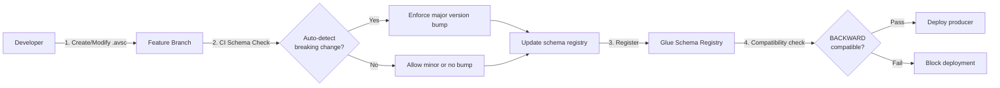

# Event Versioning Strategy — Beza Financial OS

## 1. Guiding Principles

1. **Events are contracts** — once published to Kafka, events are consumed by multiple downstream services. Changing an event is a contractual change.
2. **Backward compatibility is the default** — prefer additive changes that do not break existing consumers.
3. **Version explicit, never implicit** — every event schema carries an explicit `version` field. Relying on metadata inference is forbidden.
4. **No breaking changes without a migration plan** — any consumer-facing breaking change requires a documented migration window and consumer notification.
5. **Schema Registry is the source of truth** — all event schemas are registered in Confluent Schema Registry (or equivalent). Producers validate against the registry; consumers subscribe to specific versions.

---

## 2. When to Version

### Required — Create New Version

| Scenario | Example | Action |
|----------|---------|--------|
| Adding a required field | Adding `sender_national_id` (non-nullable) to `com.beza.remittance.order.created` | New major version |
| Removing a field | Removing `agent_commission_tier` from `com.beza.agent.cash_transaction.completed` | New major version |
| Changing field type | `balance` from `Integer` to `Long` (BigInt) | New major version |
| Renaming a field | Renaming `wallet_balance` → `available_balance` | New major version + deprecated alias |
| Changing field semantics | `status` enum adds/removes values, or same value changes meaning | New major version |
| Restructuring data | Flattening nested JSON or changing array → object | New major version |

### Optional — No New Version Required

| Scenario | Example | Action |
|----------|---------|--------|
| Adding an optional field | Adding `notes: optional string` to any event | Minor version bump (v1→v1.1) |
| Adding metadata (non-business) | Adding `traceparent` or `correlation_id` to envelope | No version change |
| Reordering fields | JSON field order changed (JSON objects are unordered) | No version change |
| Adding a new event type | New `com.beza.loan.created` event | New event, not a version of existing |

---

## 3. Version Strategy: Semantic Versioning for Events

### Format

```
com.beza.<bounded_context>.<entity>.<event_name>:v<major>[.<minor>]
```

Examples:
- `com.beza.wallet.created:v1`
- `com.beza.wallet.created:v2`
- `com.beza.remittance.order.completed:v1`
- `com.beza.remittance.order.completed:v1.1` (backward-compatible addition)
- `com.beza.agent.cash_transaction.completed:v2`

### Version Semantics

| Component | Meaning | Bump When |
|-----------|---------|-----------|
| **Major** (v1, v2) | Breaking change | Required field added/removed, field type/semantics changed, field renamed |
| **Minor** (v1.1, v1.2) | Backward-compatible addition | Optional field added |
| **Patch** (v1.0.1) | Not used for events | Schema metadata corrections only (description, examples) — never changes validation |

---

## 4. Schema Registry Integration

### Cloud-Native Architecture: AWS Glue Schema Registry

Beza uses AWS Glue Schema Registry (Apache Avro format) co-located with MSK (Amazon Managed Streaming for Apache Kafka). All schemas are registered and validated at both produce-time and consume-time.

### Schema Registration Workflow



### Schema Files — Directory Structure

```
events/schemas/
├── wallet/
│   ├── wallet.created.v1.avsc
│   ├── wallet.created.v2.avsc
│   ├── wallet.frozen.v1.avsc
│   ├── wallet.balance_changed.v1.avsc
│   └── wallet.limit_exceeded.v1.avsc
├── remittance/
│   ├── remittance.order.created.v1.avsc
│   ├── remittance.order.created.v1.1.avsc
│   ├── remittance.order.completed.v1.avsc
│   └── remittance.order.failed.v1.avsc
├── agent/
│   ├── agent.cash_transaction.completed.v1.avsc
│   └── agent.float_low.v1.avsc
├── merchant/
│   ├── merchant.payment.captured.v1.avsc
│   └── merchant.payment.settled.v1.avsc
├── compliance/
│   ├── compliance.case.opened.v1.avsc
│   └── compliance.screening.completed.v1.avsc
├── fx/
│   ├── fx.rate.updated.v1.avsc
│   └── fx.conversion.completed.v1.avsc
├── settlement/
│   ├── settlement.batch.settled.v1.avsc
│   └── settlement.batch.failed.v1.avsc
└── treasury/
    ├── treasury.liquidity_warning.v1.avsc
    └── treasury.position_snapshot_created.v1.avsc
```

### Producer-Side Validation

Every producer MUST validate against the Schema Registry before publishing:

```java
// Java Spring Boot — Kafka Producer with Schema Registry validation
@Autowired
private KafkaTemplate<String, WalletCreatedEvent> kafkaTemplate;

public void publishWalletCreated(Wallet wallet) {
    WalletCreatedEvent event = WalletCreatedEvent.builder()
        .specversion("1.0")
        .id(UUID.randomUUID().toString())
        .source("/beza/wallet/v1")
        .type("com.beza.wallet.created")
        .version(2)
        .time(Instant.now().toString())
        .datacontenttype("application/json")
        .data(WalletCreatedData.builder()
            .walletId(wallet.getId())
            .ownerId(wallet.getOwnerId())
            .currency(wallet.getCurrency().name())
            .status(wallet.getStatus().name())
            .balance(wallet.getBalance())
            .dailyLimit(wallet.getDailyLimit())
            .build())
        .build();

    // Schema Registry auto-validates compatibility on serialization
    kafkaTemplate.send("beza.wallet.event", wallet.getId(), event);
}
```

### Consumer-Side Version Declaration

Every consumer MUST declare the exact version range it supports:

```java
// Consumer that declares supported version range
@KafkaListener(topics = "beza.wallet.event", groupId = "compliance-wallet-group")
public void onWalletCreated(
    @Payload @Valid WalletCreatedEvent event,
    @Header("eventVersion") Integer version
) {
    if (version == null || version < 1 || version > 2) {
        throw new UnsupportedEventVersionException(
            "compliance-wallet-group supports wallet.created v1-v2, got v" + version
        );
    }
    processWallet(event, version);
}
```

### Consumer Compatibility Matrix (Declared in Service `bootstrap.yml`)

```yaml
beza:
  events:
    supported-versions:
      com.beza.wallet.created: "[1,2]"     # accepts v1 and v2
      com.beza.remittance.order.created: "[1,1.1]"  # accepts v1 and v1.1
      com.beza.agent.cash_transaction.completed: "[1]"  # only v1
```

---

## 5. Event Envelope Schema (CloudEvents v1.0 + Extensions)

Every Beza event follows the CloudEvents 1.0 specification with the Beza-specific `version` extension:

```json
{
  "specversion": "1.0",
  "id": "01HKABCDEFG123456789",
  "source": "/beza/wallet/v1",
  "type": "com.beza.wallet.created",
  "version": 2,
  "time": "2025-12-01T10:00:00.000Z",
  "datacontenttype": "application/json",
  "dataschema": "beza:wallet/wallet.created.v2.avsc",
  "subject": "wlt_abc123",
  "correlationid": "corr_xyz789",
  "traceparent": "00-0af7651916cd43dd8448eb211c80319c-b7ad6b7169203331-01",
  "data": {
    "wallet_id": "wlt_abc123",
    "owner_id": "usr_xyz789",
    "currency": "SYP",
    "status": "active",
    "balance": 15000000,
    "daily_limit": 100000000,
    "kyc_level_required": "BASIC"
  }
}
```

### Envelope Fields

| Field | Required | Description |
|-------|----------|-------------|
| `specversion` | Yes | CloudEvents spec version (always "1.0") |
| `id` | Yes | Unique event ID (UUID v7, time-sortable) |
| `source` | Yes | Event origin: `/beza/<context>/v<api_version>` |
| `type` | Yes | Event type: `com.beza.<context>.<entity>.<action>` |
| `version` | Yes | **Beza extension** — schema version number |
| `time` | Yes | ISO 8601 timestamp (UTC) of event occurrence |
| `datacontenttype` | Yes | Always `application/json` |
| `dataschema` | No | Reference to schema in registry |
| `subject` | No | Subject of the event (e.g. wallet_id, order_id) |
| `correlationid` | No | Business correlation ID linking related events |
| `traceparent` | No | W3C Trace Context for distributed tracing |
| `data` | Yes | Event payload (varies by type and version) |

---

## 6. Breaking vs Non-Breaking Changes — Detailed Examples

### Adding an Optional Field (Non-Breaking) — Minor Version

```diff
// wallet.created.v1.json
{
  "wallet_id": "wlt_abc123",
  "owner_id": "usr_xyz789",
  "currency": "SYP",
  "status": "active",
  "balance": 15000000,
  "daily_limit": 100000000
}

// wallet.created.v1.1.json (non-breaking, added optional field)
{
  "wallet_id": "wlt_abc123",
  "owner_id": "usr_xyz789",
  "currency": "SYP",
  "status": "active",
  "balance": 15000000,
  "daily_limit": 100000000,
+ "daily_limit_used": 2500000  // optional, consumers that ignore it continue to work
}
```

**Consumer impact:** None. Existing consumers ignore the new field.

---

### Adding a Required Field (Breaking) — New Major Version

```diff
// wallet.created.v1.json
{
  "wallet_id": "wlt_abc123",
  "owner_id": "usr_xyz789",
  "currency": "SYP",
  "status": "active",
  "balance": 15000000,
  "daily_limit": 100000000
}

// wallet.created.v2.json (breaking, required field added)
{
  "wallet_id": "wlt_abc123",
  "owner_id": "usr_xyz789",
  "currency": "SYP",
  "status": "active",
  "balance": 15000000,
  "daily_limit": 100000000,
+ "kyc_level": "BASIC",  // required — existing consumers MUST update
+ "wallet_type": "STANDARD"  // required — existing consumers MUST update
}
```

**Consumer impact:** All consumers must update to handle v2. Old v1 consumers break.

---

### Removing a Field (Breaking) — New Major Version

```diff
// wallet.created.v2.json (current)
{
  "wallet_id": "wlt_abc123",
  "owner_id": "usr_xyz789",
  "currency": "SYP",
  "status": "active",
  "balance": 15000000,
  "daily_limit": 100000000,
  "kyc_level": "BASIC",
  "wallet_type": "STANDARD"
}

// wallet.created.v3.json (breaking, field removed)
{
  "wallet_id": "wlt_abc123",
  "owner_id": "usr_xyz789",
  "currency": "SYP",
  "status": "active",
  "balance": 15000000,
  "daily_limit": 100000000,
  "kyc_level": "BASIC",
- "wallet_type": "STANDARD"  // removed — consumers reading this field fail
}
```

**Consumer impact:** Any consumer reading `wallet_type` must be updated.

---

### Renaming a Field (Breaking) — New Major Version + Deprecation

```diff
// wallet.created.v2.json (current)
{
  "wallet_id": "wlt_abc123",
  "owner_id": "usr_xyz789",
  "currency": "SYP",
  "status": "active",
- "balance": 15000000,        // old name
  "kyc_level": "BASIC"
}

// wallet.created.v3.json (renamed, with deprecated alias)
{
  "wallet_id": "wlt_abc123",
  "owner_id": "usr_xyz789",
  "currency": "SYP",
  "status": "active",
+ "wallet_balance": 15000000, // new name
+ "balance": 15000000,        // DEPRECATED — still emitted for 90 days
  "kyc_level": "BASIC"
}
```

**Consumer impact:** Consumers must migrate to `wallet_balance` within the 90-day grace period.

---

### Changing Field Type (Breaking) — New Major Version

```diff
// remittance.order.created.v1.json
{
  "order_id": "rem_abc123",
- "source_amount": 500.50,        // Float — precision issues
  "source_currency": "EUR",
  "fx_rate": 12500.00
}

// remittance.order.created.v2.json (type changed)
{
  "order_id": "rem_abc123",
+ "source_amount": 50050,         // Long (cents) — no precision loss
  "source_currency": "EUR",
  "fx_rate": 12500000             // Long (sypa — smallest SYP unit)
}
```

**Consumer impact:** All consumers must update parsing logic. Old consumers crash on type mismatch.

---

### Changing Enum Values (Potentially Breaking) — New Major Version

```diff
// wallet.created.v2.json
{
  "wallet_id": "wlt_abc123",
  "status": "active",       // old enum: active | frozen | closed
}

// wallet.created.v3.json — new enum value added (non-breaking for most, but careful)
{
  "wallet_id": "wlt_abc123",
  "status": "dormant",      // new: active | frozen | closed | dormant
}
```

**Rule:** Adding enum values is **non-breaking** if consumers use a default branch/wildcard. It is **breaking** if consumers use exhaustive switch/match without wildcard.

---

## 7. Deprecation and Migration Policy

### Event Deprecation Lifecycle

```
v1 (active) ──→ v1 (deprecated) ──→ v1 (removed)
                    ↑                    ↑
               Announcement          After 90-day
               + notify all          grace period
               consumers             + consumer migration
               + publish v2          confirmed
```

### Timeline

| Phase | Duration | Actions |
|-------|----------|---------|
| **Active** | Indefinite | Event version is the current production version |
| **Deprecation announced** | Day 0 | New version published. Old version marked `deprecated` in Schema Registry. All consumers notified via Slack + email. Deprecation notice added to event documentation. |
| **Migration window** | Days 0–90 | Both versions coexist. Consumers migrate at their own pace. Schema Registry enforces BACKWARD compatibility between v1 and v2 (v2 consumers can read v1 events via compatibility bridge). |
| **Old version removed** | Day 90 | Deprecated version deleted from Schema Registry. Producer stops publishing old version. Consumers still on old version experience delivery failures. |
| **Extension (if needed)** | Day 90+ | For high-complexity migrations (e.g., 20+ consumers), a 30-day extension may be granted by the Architecture Review Board. |

### Notification Template for Deprecation

```
Subject: [ACTION REQUIRED] Event `com.beza.wallet.created:v1` deprecated — migrate to v2

Hello {team},

Event `com.beza.wallet.created:v1` is now DEPRECATED.

- Current version: v1
- New version: v2
- Migration deadline: {date} (90 days from this notice)
- Breaking changes: Added required fields `kyc_level` and `wallet_type`
- Migration guide: https://beza.internal/docs/events/wallet/created-v1-to-v2

Your service {service_name} is a consumer of this event.
Your declared supported version: {declared_version}
Your migration status: {NOT_STARTED | IN_PROGRESS | COMPLETED}

Please update your consumer before the deadline. After {date}, v1 events will
no longer be published and un-migrated consumers will experience data loss.

-- Beza Platform Team
```

---

## 8. CI/CD Enforcement

### Schema Compatibility Checks (CI Pipeline)

Every PR that modifies an `.avsc` schema file triggers automated compatibility checks:

```yaml
# .github/workflows/schema-compatibility.yml
name: Schema Compatibility Check
on:
  pull_request:
    paths:
      - 'events/schemas/**/*.avsc'

jobs:
  check-compatibility:
    runs-on: ubuntu-latest
    steps:
      - uses: actions/checkout@v4
      - name: Check schema compatibility
        run: |
          # For each changed schema, check against registry
          CHANGED_SCHEMAS=$(git diff --name-only origin/main...HEAD -- 'events/schemas/**/*.avsc')
          for schema in $CHANGED_SCHEMAS; do
            echo "Checking $schema..."
            java -jar schema-compatibility-checker.jar \
              --registry-url=${{ secrets.SCHEMA_REGISTRY_URL }} \
              --schema-file=$schema \
              --compatibility=BACKWARD
            if [ $? -ne 0 ]; then
              echo "BREAKING CHANGE DETECTED in $schema"
              echo "Major version bump required"
              exit 1
            fi
          done
```

### Breaking Change Detection — Automated

```java
// Pseudo-code for CI breaking change detector
public class BreakingChangeDetector {

    enum ChangeType {
        BACKWARD_COMPATIBLE,    // optional field added
        BACKWARD_INCOMPATIBLE   // required field added, removed, type changed
    }

    public ChangeType detectChange(Schema oldSchema, Schema newSchema) {
        // Check for removed fields
        for (Field oldField : oldSchema.getFields()) {
            if (!newSchema.hasField(oldField.name()) && oldField.isRequired()) {
                return ChangeType.BACKWARD_INCOMPATIBLE; // Required field removed
            }
        }
        // Check for required field additions
        for (Field newField : newSchema.getFields()) {
            if (!oldSchema.hasField(newField.name()) && newField.isRequired()) {
                return ChangeType.BACKWARD_INCOMPATIBLE; // Required field added
            }
        }
        // Check type changes
        for (Field oldField : oldSchema.getFields()) {
            Field newField = newSchema.getField(oldField.name());
            if (newField != null && !oldField.type().equals(newField.type())) {
                return ChangeType.BACKWARD_INCOMPATIBLE; // Type changed
            }
        }
        return ChangeType.BACKWARD_COMPATIBLE; // All changes are additive+optional
    }
}
```

### Version Bump Enforcement in Code

Each event class carries a `@EventVersion` annotation that is checked at build time:

```java
@EventVersion(
    type = "com.beza.wallet.created",
    version = 2,
    since = "2025-12-01",
    deprecates = @DeprecatedVersion(version = 1, deprecatedSince = "2025-12-01", removalDate = "2026-03-01")
)
public class WalletCreatedEvent {
    // ...
}
```

Build-time annotation processor enforces:
- If `@EventVersion.version` does not match the registered schema version → BUILD FAILURE
- If the schema is a breaking change but `version` is not incremented → BUILD FAILURE
- If `deprecates` is set, guarantees `removalDate ≥ deprecatedSince + 90 days`

---

## 9. Version Compatibility in Kafka Topology

### Multiple Version Topics (Strategy A)

For high-volume events where consumers need isolation, separate topics per major version:

```
beza.wallet.event.v1   ← producers publish v1, v1 consumers subscribe
beza.wallet.event.v2   ← producers publish v2, v2 consumers subscribe
```

**Pros:** Complete consumer isolation, no cross-version data pollution.  
**Cons:** Topic proliferation (2× per event type per major version).  

### Single Topic with Versioned Schema (Strategy B — RECOMMENDED)

Single topic, Schema Registry validates and routes per consumer group:

```
beza.wallet.event   ← all versions co-exist in one topic
                     │
                     ├── compliance-group ← reads v1 only (declared: [1])
                     ├── notification-group ← reads v1-v2 (declared: [1,2])
                     └── analytics-group ← reads v2+ (declared: [2,3])
```

**Pros:** Simple topology, schema registry handles compatibility, consumers declare their range.  
**Cons:** Payload size variability, consumers must handle version field.  

**Beza's default is Strategy B.** Strategy A is reserved for events where:
- Major version introduces fundamentally different data shape (>50% field changes)
- Regulatory compliance requires strict version isolation (e.g., compliance event versions tied to specific CBS regulation versions)

---

## 10. Syria-Specific Versioning Considerations

### 10.1 CBS Regulatory Reporting Events

CBS regulatory reporting schemas are versioned according to CBS circular numbers:

```
com.beza.compliance.monthly_return:v1     → CBS Circular 31/2010 reporting format
com.beza.compliance.monthly_return:v2     → CBS Circular 42/2023 reporting format (updated)
```

When CBS issues a new circular changing reporting requirements, a new major version is created for the affected events. The old version is kept for audit/historical record purposes but marked `deprecated` in the registry.

### 10.2 Arabic-Script Fields

Events containing Arabic text fields (e.g., `beneficiary_name_ar`, `business_name_ar`) follow these versioning rules:
- Adding a new Arabic field → non-breaking (optional)
- Changing encoding (e.g., Buckwalter transliteration → Unicode normalization form NFC) → major version bump
- Adding `_ar` suffix JSON key alongside existing `_en` → non-breaking minor version

### 10.3 Sanctions List Versioning

Compliance events carry a `sanctions_list_version` metadata field that follows the OFAC SDN list release cycle:
- OFAC SDN updates are published ~weekly (typically Fridays)
- When Beza processes a new sanctions list, the `sanctions_list_version` in compliance events is updated
- This is a data change, not a schema change — no version bump unless the structure changes

### 10.4 Holiday Calendar Events

Syria observes a different holiday calendar than Western countries (Friday-Saturday weekend, Islamic holidays). Settlement batch events carry a `calendar_version` field indicating the holiday calendar used for T+1/T+2 computation. When the holiday calendar is updated (annually), `calendar_version` is incremented — this is a data change, not a schema version change.

---

## 11. Summary Table

| Change | Version Impact | Consumer Action Required | Migration |
|--------|---------------|------------------------|-----------|
| Add optional field | Minor (v1→v1.1) | No | None |
| Add required field | Major (v1→v2) | Yes — update consumer | 90-day coexistence |
| Remove field | Major (v1→v2) | Yes — update consumer | 90-day coexistence |
| Rename field | Major (v1→v2) | Yes — migrate to new name | 90-day deprecation alias |
| Change field type | Major (v1→v2) | Yes — update parsing | 90-day coexistence |
| Change field semantics | Major (v1→v2) | Yes — may need logic update | 90-day coexistence + documentation |
| Add enum value | Minor (v1→v1.1) | No — if wildcard used | None |
| Remove enum value | Major (v1→v2) | Yes — update consumer | 90-day coexistence |
| Deprecate entire event | Major (v1→deprecated) | Yes — migrate to alternative | 90-day grace period |
| Add new event type | New event (not version) | No — optional new consumer | None |
| Correct schema metadata | Patch (no version change) | No | None |
