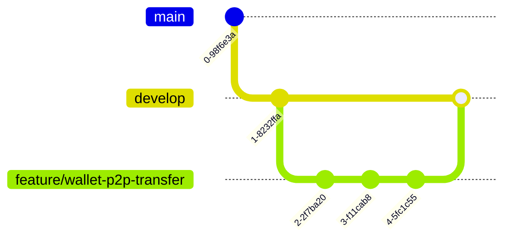

# Branching Model — Beza Platform

## Branch Overview

| Branch | Purpose | Source | Protection | Deploys To | Lifespan |
|--------|---------|--------|------------|------------|----------|
| `main` | Production-ready code | — | Protected, require PR, require CI | Production | Permanent |
| `develop` | Integration branch for features | `main` | Protected, require PR, require CI | Staging | Permanent |
| `feature/{module}-{description}` | New feature or enhancement | `develop` | None | — | Short-lived (days) |
| `fix/{module}-{description}` | Bug fix on `develop` | `develop` | None | — | Short-lived |
| `release/v{version}` | Release candidate preparation | `develop` | Protected | Staging → QA | Until release |
| `hotfix/{description}` | Urgent production fix | `main` | None | Production | Short-lived (hours) |

## Branch Naming Rules

### Feature Branches
```
feature/{module}-{short-description}
feature/wallet-p2p-transfer
feature/agent-cash-in-qr-code
feature/fx-auto-rate-update
feature/kyc-document-ocr
```

- Module matches commit scope list (wallet, agent, fx, etc.).
- Description is kebab-case, max 5 words.
- No issue/PR numbers in branch name (referenced in PR description).

### Fix Branches
```
fix/{module}-{short-description}
fix/wallet-negative-balance-edge-case
fix/agent-commission-rounding
fix/auth-otp-timing-issue
```

### Release Branches
```
release/v{major}.{minor}.{patch}
release/v1.2.0
release/v2.0.0
```

### Hotfix Branches
```
hotfix/{short-description}
hotfix/critical-balance-discrepancy
hotfix/auth-security-vulnerability
hotfix/fx-rate-stale-data
```

Hotfix branches are created from `main`, fixed, merged back to both `main` and `develop`.

## Workflow

### 1. Feature Development



1. **Create branch** from `develop`: `git checkout -b feature/wallet-p2p-transfer develop`
2. **Develop** with frequent commits following commit conventions.
3. **Keep updated**: `git rebase develop` (preferred) or `git merge develop` to stay current.
4. **Push**: `git push origin feature/wallet-p2p-transfer`
5. **Create PR** targeting `develop` with description template.

### 2. Code Review
1. PR author assigns at least 1 reviewer.
2. Reviewer runs the code review checklist (see `08-code-review-checklist.md`).
3. CI must pass (lint, tests, coverage, security scan).
4. Reviewer approves or requests changes.
5. Author addresses feedback with additional commits (not amended).

### 3. Merge to Develop
1. Squash merge into `develop`: preserves a clean history.
2. Squash commit message follows commit convention: `feat(wallet): add P2P transfer by phone number`.
3. Delete the feature branch after merge.

### 4. Release Process
1. **Create release branch**: `git checkout -b release/v1.2.0 develop`
2. **Stabilize**: Bug fixes only. No new features.
3. **Version bump**: Update version in:
   - `app/config/app.php` (version)
   - `mobile/pubspec.yaml` (version)
   - `admin/package.json` (version)
4. **QA testing** on release branch.
5. **Merge to main** (regular merge, not squash): `git checkout main && git merge release/v1.2.0 --no-ff`
6. **Tag release**: `git tag v1.2.0`
7. **Merge back to develop**: `git checkout develop && git merge release/v1.2.0 --no-ff`
8. **Delete release branch**.

### 5. Hotfix Process
1. **Create hotfix branch**: `git checkout -b hotfix/critical-fix main`
2. **Fix** and commit.
3. **PR** targeting `main` (urgent, may merge with 0 approvals in emergency).
4. **Merge to main**: `git checkout main && git merge hotfix/critical-fix --no-ff`
5. **Tag patch**: `git tag v1.2.1`
6. **Merge to develop**: `git checkout develop && git merge hotfix/critical-fix --no-ff`
7. **Delete hotfix branch**.

## Merge Strategies

| Scenario | Strategy | Reason |
|----------|----------|--------|
| Feature → Develop | Squash merge | Clean linear history, one commit per feature |
| Release → Main | Regular merge (`--no-ff`) | Preserves release branch context |
| Main → Develop | Regular merge (`--no-ff`) | Keeps develop up to date with release history |
| Hotfix → Main | Regular merge (`--no-ff`) | Preserves hotfix branch context |
| Hotfix → Develop | Regular merge (`--no-ff`) | Keeps develop up to date |

## Branch Protection Rules (GitHub)

### `main` Branch
- Require pull request before merging.
- Require at least 1 approval (2 for release/hotfix).
- Dismiss stale approvals when new commits are pushed.
- Require status checks: CI (all), lint, test, coverage, security scan.
- Require branches to be up to date.
- Do not allow bypass (admins included).
- Require linear history (no merge commits from feature branches).
- Include administrators in restrictions.

### `develop` Branch
- Require pull request before merging.
- Require at least 1 approval.
- Require status checks: CI, lint, test, coverage.
- Do not allow bypass.

## Syria Context

### Scheduling
- No deployments on Friday (Syrian day of rest) unless security-critical hotfix.
- Releases prefer Sunday through Wednesday to avoid weekend issues.
- Deployments happen during Syria business hours (09:00-15:00 AST) for immediate rollback if needed.
- Hotfixes exempt from scheduling restrictions.

### Emergency Process
In the event of a production incident (P0/P1):
1. Tagged developer creates hotfix branch from `main`.
2. Fix applied, PR created with label `emergency`.
3. 1 approval sufficient (CTO or Engineering Lead).
4. Deployed to production, monitoring for 30 minutes.
5. Post-mortem created within 24 hours.
