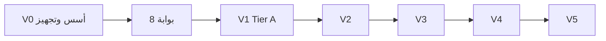
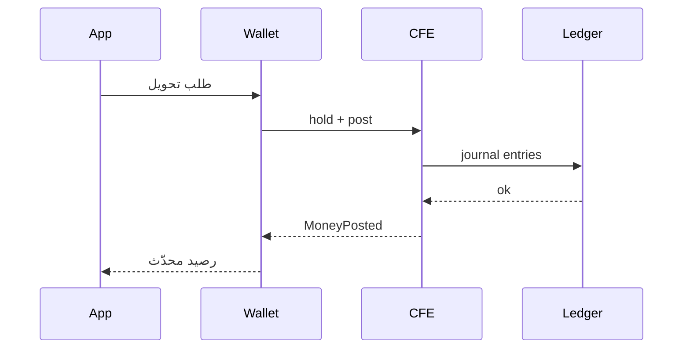

# خطة Beza V0 — الأسس والبنية والتجهيز والشرح

## ما هو V0؟

**V0 ليس إصداراً للمستخدم النهائي.** هو مرحلة **تحضير ومعرفة وبنية تحتية للفريق** قبل تنفيذ [خطة V1](.cursor/plans/خطة_بناء_beza_v1_152cd23a.plan.md).

| V0 | V1 |
|----|-----|
| فهم + توثيق + بيئة + حوكمة + فجوات | ميزات Tier A + إطلاق |
| لا P2P إنتاجي كامل | نعم |
| يمكن تنفيذها **بالتوازي** مع إصلاح Ledger إن كان الفريق موجوداً | يبدأ رسمياً بعد **بوابة 8** |



---

## سلسلة الخطط الكاملة

| مرحلة | الملف | الغرض |
|--------|--------|--------|
| **V0** | هذا المستند | شرح + تجهيز |
| V1 | [خطة_بناء_beza_v1_152cd23a.plan.md](.cursor/plans/خطة_بناء_beza_v1_152cd23a.plan.md) | إطلاق أساسي |
| V2 | [خطة_بناء_beza_v2_69780e8a.plan.md](.cursor/plans/خطة_بناء_beza_v2_69780e8a.plan.md) | Tier B+C |
| V3 | [خطة_بناء_beza_v3_7f921b42.plan.md](.cursor/plans/خطة_بناء_beza_v3_7f921b42.plan.md) | Tier D |
| V4 | [خطة_بناء_beza_v4_7cc85ffd.plan.md](.cursor/plans/خطة_بناء_beza_v4_7cc85ffd.plan.md) | Tier E |
| V5 | [خطة_بناء_beza_v5_e4ef8424.plan.md](.cursor/plans/خطة_بناء_beza_v5_e4ef8424.plan.md) | إقليم + ecosystem |

---

# الجزء الأول: الشرح (للفريق والمستثمر التقني)

## 1 — شرح المنصة وخريطة المعرفة

**الهدف:** أي مطوّر جديد يفهم *ماذا نبني* و*أين يقرأ* خلال يومين.

### 1.1 ما هي Beza؟
- 1.1.1 إنشاء [`.opencode/docs/onboarding/00-what-is-beza.md`](.opencode/docs/onboarding/00-what-is-beza.md) (عربي + إنجليزي مختصر):
  - **Financial OS لسوريا**: محفظة، وكيل، FX، حوالات، فواتير، تاجر.
  - الجمهور: 18M محلي + 6M جالية؛ اقتصاد نقدي >85%.
  - القنوات: Flutter، USSD `*123#`، SMS، Admin، Agent POS (لاحقاً).
  - مرجع الرؤية: [`product/01-vision-2026.md`](.opencode/docs/product/01-vision-2026.md).

### 1.2 نظام التوثيق (Documentation OS)
- 1.2.1 شرح المستويات الستة من [`.opencode/README.md`](.opencode/README.md):

```
Level 1  .opencode/docs/           → رؤية، معمارية، API، تنفيذ
Level 2  .opencode/features/       → Feature Bible (~30 ملف/منتج)
Level 3  .opencode/implementation/ → Laravel, Flutter, React specs
Level 4  .opencode/tasks/          → مهام قابلة للتنفيذ
Level 5  .opencode/tasks/ai/       → blueprints للوكلاء
Level 6  (مولّد)                   → هيكل مصدر متوقع
docs/openapi.yaml                  → عقد REST العام (جذر repo)
```

- 1.2.2 مخطط «أين أبحث عن X؟» — جدول في نفس ملف onboarding:

| أريد أن… | اقرأ |
|----------|------|
| أفهم ترتيب البناء | `docs/execution/01-build-order.md` |
| أعرف نطاق V1 | `docs/roadmap/02-v1-scope.md` |
| أبني شاشة Flutter | `execution/04-screen-inventory.md` + `features/{x}/11-flutter-screens.md` |
| أحرّك أموالاً | `financial-core/01-cfe-v2.md` + guardrails G-001 |
| أضيف endpoint | `docs/api/01-api-standards.md` + `docs/openapi.yaml` |
| أختبر رحلة | `docs/journeys/` + `execution/03-user-journeys-index.md` |

### 1.3 المنتجات والمراحل (V1→V5)
- 1.3.1 صفحة واحدة في onboarding تلخّص [`01-product-prioritization.md`](.opencode/docs/roadmap/01-product-prioritization.md) + روابط خطط `.cursor/plans/`.
- 1.3.2 توضيح: **الكود الحالي متقدم في الباكند** لكن **الموبايل shell** — لا تعتمد على `[x]` في v1-scope دون تحقق.

### 1.4 مسرد سوريا (Glossary)
- 1.4.1 [`.opencode/docs/onboarding/01-syria-glossary.md`](.opencode/docs/onboarding/01-syria-glossary.md):
  - CBS، BSO، SIIB، PEED، محافظات، +963، SYP/USD، mudaraba، Tier 1/2/3، SMPP، Syriatel/MTN.

**إغلاق 1:** مطوّر تجريبي يجيب على اختبار قصير (10 أسئلة) عن docs map + CFE vs Wallet.

---

## 2 — البنية المعمارية والقرارات (شرح + تحقق)

**الهدف:** فهم **لماذا** Modular Monolith وليس microservices في V1.

### 2.1 طبقات النظام
- 2.1.1 شرح مخطط [`architecture/01-system-overview.md`](.opencode/docs/architecture/01-system-overview.md):
  - Presentation → Nginx → Laravel Modules → Events → MySQL/Redis.
  - V1: **لا Kafka، لا K8s** — Docker Compose ([`engineering/current-summary.md`](.opencode/docs/engineering/current-summary.md)).
- 2.1.2 [`00-system-context.md`](.opencode/docs/architecture/00-system-context.md): CBS، Syriatel، شركاء حوالات.

### 2.2 المسار الحرج للأموال (الأهم)
- 2.2.1 رسم تدفق إلزامي:



- 2.2.2 قاعدة: **Wallet = projection؛ Ledger = truth؛ CFE = بوابة مالية وحيدة** ([`ADR-004`](.opencode/docs/adr/ADR-004-wallet-ledger-separation.md)).

### 2.3 ADRs — قراءة إلزامية
- 2.3.1 ورشة 2 ساعات على [`docs/adr/`](.opencode/docs/adr/):
  - ADR-001 MySQL، ADR-002 monolith، ADR-003 FX 15s، ADR-004 wallet/ledger، ADR-006 event sourcing، ADR-007 marketplace مؤجل.
- 2.3.2 ملخص قرار واحد لكل ADR في onboarding.

### 2.4 Guardrails G-001–G-010
- 2.4.1 [`10-architecture-guardrails.md`](.opencode/docs/engineering/10-architecture-guardrails.md) — ملصق على جدار Slack:
  - لا `DB::` مالي خارج Repository.
  - لا تحويل بدون CFE.
  - أحداث بين modules فقط.
  - Money = bigint minor units ([`13-money-handling-standard.md`](.opencode/docs/engineering/13-money-handling-standard.md)).

**إغلاق 2:** كل مطوّر يوقّع إقرار guardrails.

---

## 3 — هيكل المستودع ومعايير الكود

### 3.1 خريطة المجلدات
- 3.1.1 وثيقة [`.opencode/docs/onboarding/02-repo-map.md`](.opencode/docs/onboarding/02-repo-map.md):

| مسار | محتوى |
|------|--------|
| `app/Modules/{Name}/` | Routes, Controllers, Services, Models, Tests, Migrations |
| `app/Domain/ValueObjects/` | Money, إلخ |
| `mobile/lib/` | Flutter feature-first |
| `admin/src/` | React Admin (stub) |
| `docs/openapi.yaml` | API contract |
| `.opencode/` | كل التوثيق |
| `docker/` | PHP, Nginx |
| `tests/Feature/` | تكامل عابر للوحدات |

- 3.1.2 قائمة **27 module** فعلية (ليس 24 من README القديم).

### 3.2 قالب Module
- 3.2.1 شرح [`implementation/backend/01-laravel-architecture.md`](.opencode/implementation/backend/01-laravel-architecture.md).
- 3.2.2 [`02-laravel-conventions.md`](.opencode/docs/engineering/02-laravel-conventions.md): Controller → Service → Repository → Event.

### 3.3 Flutter و Admin
- 3.3.1 [`04-flutter-conventions.md`](.opencode/docs/engineering/04-flutter-conventions.md): Riverpod, GoRouter, Dio.
- 3.3.2 [`03-react-conventions.md`](.opencode/docs/engineering/03-react-conventions.md) + [`implementation/frontend/01-react-admin.md`](.opencode/implementation/frontend/01-react-admin.md).

### 3.4 Definition of Done
- 3.4.1 [`10-definition-of-done.md`](.opencode/docs/engineering/10-definition-of-done.md) — checklist مطبوع لكل PR.

**إغلاق 3:** `02-repo-map.md` مراجعة من Tech Lead.

---

## 4 — تجهيز البنية التحتية المحلية

**الهدف:** `docker compose up` + `flutter run` + `pest` يعملان على جهاز كل مطوّر.

### 4.1 متطلبات الجهاز
- 4.1.1 [`.opencode/docs/onboarding/03-dev-setup.md`](.opencode/docs/onboarding/03-dev-setup.md):
  - PHP 8.5+, Composer, Node 20+ (لـ admin لاحقاً), Flutter 3.x, Docker Desktop, Git.

### 4.2 Backend
- 4.2.1 `cp .env.example .env` — شرح كل متغير (DB, Redis, JWT, queue).
- 4.2.2 `docker compose up -d` — PHP-FPM, MySQL 8, Redis 7, Nginx.
- 4.2.3 `php artisan migrate --seed` (أو documented fresh path).
- 4.2.4 `php artisan serve` أو عبر Nginx — `GET /api/health` ([`Auth/HealthController`](app/Modules/Auth/Controllers/HealthController.php)).

### 4.3 Mobile
- 4.3.1 `mobile/.env` أو `config` — `API_BASE_URL` لـ Laragon/host.
- 4.3.2 `flutter pub get` + `flutter run` — شاشة splash/welcome.
- 4.3.3 [`.vscode/launch.json`](.vscode/launch.json) — إعدادات جاهزة.

### 4.4 CI محلي
- 4.4.1 `composer test` / `./vendor/bin/pest`.
- 4.4.2 `./vendor/bin/phpstan analyse` (مستوى 6 هدف).
- 4.4.3 محاكاة CI: MySQL في Docker وليس SQLite فقط للمسارات المالية.

### 4.5 أدوات مساعدة
- 4.5.1 Postman/Insomnia collection من `openapi.yaml` (يُولَّد في V0 أو V1).
- 4.5.2 Redis Insight / TablePlus اختياري — توثيق الاتصال.

**إغلاق 4:** checklist في `03-dev-setup.md` موقّع من 100% الفريق.

---

## 5 — حوكمة الفريق والعمليات

### 5.1 أدوار RACI
- 5.1.1 [`.opencode/docs/onboarding/04-team-raci.md`](.opencode/docs/onboarding/04-team-raci.md):
  - Product, Backend, Flutter, DevOps, Compliance, QA.

### 5.2 Git و branching
- 5.2.1 [`06-git-strategy.md`](.opencode/docs/engineering/06-git-strategy.md) + [`07-branching-model.md`](.opencode/docs/engineering/07-branching-model.md).
- 5.2.2 [`08-code-review-checklist.md`](.opencode/docs/engineering/08-code-review-checklist.md) — إلزامي على PR مالي.

### 5.3 أمان التطوير
- 5.3.1 لا secrets في git — `.env` فقط.
- 5.3.2 [`security/01-zero-trust.md`](.opencode/docs/security/01-zero-trust.md) — ملخص للمطورين.

### 5.4 اجتماعات إيقاع
- 5.4.1 Weekly architecture review (30 min).
- 5.4.2 تعريف «جاهز لـ V1» = إغلاق مهمة 8 أدناه.

**إغلاق 5:** RACI معتمد + قالب PR في GitHub.

---

## 6 — تدقيق الفجوات ومصفوفة التتبع

**الهدف:** صورة واحدة صادقة قبل كتابة ميزات جديدة.

### 6.1 تقرير الفجوات
- 6.1.1 [`.opencode/docs/engineering/00-gap-analysis.md`](.opencode/docs/engineering/00-gap-analysis.md):

| منطقة | التوثيق يقول | الكود الفعلي | أولوية V1 |
|--------|--------------|--------------|-----------|
| Ledger | مكتمل | 8 tests fail | P0 |
| Wallet-CFE | مكتمل | 3 integration fail | P0 |
| Mobile | 100+ شاشة | ~40 route, hubs | P1 |
| Admin | full spec | 7 files stub | P1 |
| USSD | في V1 scope | غير موجود | P1 |
| Modules Tier B–D | «سبرنتات منتهية» | skeleton | خارج V1 |

### 6.2 مصفوفة التتبع
- 6.2.1 [`.opencode/docs/execution/00-traceability-matrix.md`](.opencode/docs/execution/00-traceability-matrix.md):
  - أعمدة: Journey # | Feature Bible | Module | API route | Flutter route | Test file | Status.

### 6.3 تحديث current-summary
- 6.3.1 إعادة كتابة [`current-summary.md`](.opencode/docs/engineering/current-summary.md) من `00-gap-analysis` — **مصدر حالة واحد**.

**إغلاق 6:** Tech Lead يعتمد Gap Analysis.

---

## 7 — خارطة الطريق الموحدة V0→V5

### 7.1 Master roadmap
- 7.1.1 [`.opencode/docs/roadmap/00-master-roadmap.md`](.opencode/docs/roadmap/00-master-roadmap.md):
  - جدول: Phase | Weeks cum. | Products | Plan file | Gate.
  - إجمالي ~38 شهر من V0→V5 (انظر V5 plan).

### 7.2 Gantt مبسّط

```
V0  ██ (2-3 أسابيع)  أسس
V1  ████████████      Tier A + go-live
V2  ████████████      B+C
V3  ████████████████  D
V4  ████████████████████ E
V5  ████████████████    إقليم
```

**إغلاق 7:** `00-master-roadmap.md` في README الرئيسي مربوط.

---

## 8 — بوابة الانتقال إلى V1

**لا تبدأ V1-task-1 حتى تُغلق كل البنود.**

### 8.1 Checklist بوابة V0 → V1

| # | بند | مسؤول |
|---|------|--------|
| B1 | onboarding docs 00–04 منشورة | Tech Lead |
| B2 | 100% الفريق: dev setup يعمل | DevOps |
| B3 | guardrails موقّعة | الكل |
| B4 | gap-analysis معتمد | Product + Tech |
| B5 | traceability matrix v1 لـ Tier A journeys 1–9 | QA |
| B6 | docker + CI أخضر على Auth/Health | Backend |
| B7 | master-roadmap في README | PM |
| B8 | ورشة معمارية مسجّلة (recording/link) | Architect |

### 8.2 ما ينتقل من V0 إلى V1 (بدون تكرار)

| كان في V1 مهمة 1 | يُنفَّذ في |
|------------------|------------|
| شرح docs | **V0 مهمة 1–2** |
| docker/CI/env | **V0 مهمة 4** |
| gap + README | **V0 مهمة 6** |
| design tokens + openapi fix | **V1 مهمة 1** (تنفيذ فقط) |

**إغلاق V0:** B1–B8 ✅ → يُفتح [خطة V1](.cursor/plans/خطة_بناء_beza_v1_152cd23a.plan.md) عند المهمة 1.

---

## تقدير زمني V0

| مهمة | مدة |
|------|-----|
| 1 شرح | 3–5 أيام |
| 2 معمارية | 2–3 أيام |
| 3 repo | 2 أيام |
| 4 تجهيز | 3–5 أيام |
| 5 حوكمة | 2 أيام |
| 6 فجوات | 3–5 أيام |
| 7 master roadmap | 1 يوم |
| 8 بوابة | 1 يوم |
| **المجموع** | **2–3 أسابيع** (فريق 3–6) |

---

## مخرجات V0 (ملفات تُنشأ)

| ملف | غرض |
|-----|------|
| `onboarding/00-what-is-beza.md` | شرح المنصة |
| `onboarding/01-syria-glossary.md` | مسرد |
| `onboarding/02-repo-map.md` | خريطة repo |
| `onboarding/03-dev-setup.md` | تجهيز محلي |
| `onboarding/04-team-raci.md` | أدوار |
| `engineering/00-gap-analysis.md` | فجوات |
| `execution/00-traceability-matrix.md` | تتبع |
| `roadmap/00-master-roadmap.md` | V0–V5 |

---

## علاقة V0 بالكود الموجود

المستودع **ليس فارغاً** — V0 **لا يعيد البناء من الصفر**، بل:
1. يفسّر ما بُني ([`current-summary`](.opencode/docs/engineering/current-summary.md) سابقاً مبالغ فيه).
2. يجهّز الفريق للإصلاح (Ledger, Wallet-CFE) في V1 مهمة 2.
3. يمنع بناء ميزات Tier B–D قبل أوانها.

---

## مخاطر إن تُخطى V0

| خطر | أثر |
|-----|-----|
| بناء فوق فجوات Ledger | دَين معماري |
| فريق لا يفهم CFE | تحويلات مباشرة على DB |
| docs OS غير معروف | تنفيذ مخالف للـ bibles |
| CI SQLite فقط | اختبارات خضراء كاذبة |
