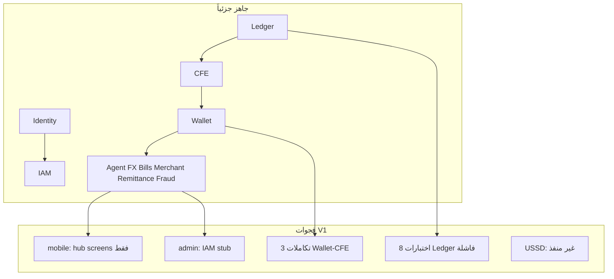

# خطة بناء Beza Platform — V1 حتى الإطلاق

> **شرط مسبق:** إغلاق [خطة V0 — الأسس والتجهيز](.cursor/plans/خطة_بناء_beza_v0_الأسس.plan.md) (بوابة 8: B1–B8). مهمة V1 «1 — التأسيس» = تنفيذ design tokens + openapi (ما سبق يُشرح ويُجهّز في V0).

## مصادر الحقيقة (يجب الرجوع إليها في كل مهمة فرعية)

| المصدر | المسار | الاستخدام |
|--------|--------|-----------|
| ترتيب البناء | [`.opencode/docs/execution/01-build-order.md`](.opencode/docs/execution/01-build-order.md) | تبعيات المراحل |
| نطاق V1 | [`.opencode/docs/roadmap/02-v1-scope.md`](.opencode/docs/roadmap/02-v1-scope.md) | قبول المنتج |
| الشاشات | [`.opencode/docs/execution/04-screen-inventory.md`](.opencode/docs/execution/04-screen-inventory.md) | Flutter V1 فقط (أقسام 1.1–1.7 + 1.9) |
| الرحلات | [`.opencode/docs/execution/03-user-journeys-index.md`](.opencode/docs/execution/03-user-journeys-index.md) + [`journeys/01`–`09`](.opencode/docs/journeys/) | سيناريوهات E2E |
| الهوية البصرية | [`.opencode/docs/design/01-design-language-2026.md`](.opencode/docs/design/01-design-language-2026.md) + [`.opencode/shared/design-system/`](.opencode/shared/design-system/) | ألوان، خطوط، مكونات |
| معايير الكود | [`.opencode/docs/engineering/02-laravel-conventions.md`](.opencode/docs/engineering/02-laravel-conventions.md), [`04-flutter-conventions.md`](.opencode/docs/engineering/04-flutter-conventions.md) | Laravel + Flutter |
| Definition of Done | [`.opencode/docs/engineering/10-definition-of-done.md`](.opencode/docs/engineering/10-definition-of-done.md) | إغلاق كل مهمة |
| حراس المعمارية | [`.opencode/docs/engineering/10-architecture-guardrails.md`](.opencode/docs/engineering/10-architecture-guardrails.md) | G-001–G-010 |
| API | [`docs/openapi.yaml`](docs/openapi.yaml) + [`.opencode/docs/api/`](.opencode/docs/api/) | عقد REST |
| حالة الكود | [`.opencode/docs/engineering/current-summary.md`](.opencode/docs/engineering/current-summary.md) | فجوات معروفة |
| Feature Bibles | [`.opencode/features/{wallet,agent-network,fx,remittance,bill-payment,merchant,25-fraud-management}/`](.opencode/features/) | تفاصيل كل منتج V1 |

**خارج النطاق (حسب اختيارك):** Payroll, Savings, Cards, Loyalty, Gov, Education, Humanitarian, OpenFinance, Marketplace — تُؤجل بعد إطلاق V1.

---

## الوضع الحالي (ملخص)



---

## المبدأ التنفيذي

1. **لا انتقال من المهمة 2 قبل إغلاق كل بنود 1.x** (اختبارات خضراء + DoD).
2. كل مهمة فرعية تنتهي بـ: كود + اختبار + محاذاة `openapi.yaml` + مراجعة DoD.
3. **CFE فقط** لحركة الأموال؛ **Ledger** مصدر الحقيقة؛ أحداث بين الوحدات فقط.

---

## 1 — التأسيس والمحاذاة (أسبوع 1)

**الهدف:** مصدر حقيقة واحد، بيئة تطوير موحدة، تصميم جاهز للتنفيذ.

### 1.1 توحيد التوثيق مع الكود
- 1.1.1 تحديث [`README.md`](README.md): 27 وحدة، إزالة `Transfer/` المنفصل، ربط `Wallet` للتحويلات.
- 1.1.2 مزامنة [`02-v1-scope.md`](.opencode/docs/roadmap/02-v1-scope.md) مع الواقع: V1 = Tier A فقط؛ إلغاء `[x]` للمنتجات خارج النطاق.
- 1.1.3 تحديث [`current-summary.md`](.opencode/docs/engineering/current-summary.md): حالة V1 فعلية (ليس “19 sprint مكتمل”).
- 1.1.4 إنشاء `docs/postman/` أو تحديث README إن وُجد Postman لاحقاً.

### 1.2 بيئة التطوير والـ CI
- 1.2.1 التحقق من [`docker-compose.yml`](docker-compose.yml): PHP, MySQL 8, Redis, Nginx — تشغيل محلي موثّق.
- 1.2.2 [`.github/workflows/ci.yml`](.github/workflows/ci.yml): PHPStan + Pest على MySQL (ليس SQLite فقط للتكامل المالي).
- 1.2.3 `.env.example`: متغيرات Syriatel SMPP, CBS, JWT, Redis queues.

### 1.3 نظام التصميم (قبل أي شاشة Flutter جديدة)
- 1.3.1 تنفيذ tokens في [`mobile/lib/core/theme/`](mobile/lib/core/theme/): ألوان `#0D7C4A`, `#C8962E`, Noto Sans Arabic, spacing 4px grid.
- 1.3.2 مكتبة widgets مشتركة: `BezaButton`, `BezaInput`, `AmountField`, `PinPad`, `BalanceCard`, `TransactionTile` — من [`shared/design-system/02-components.md`](.opencode/shared/design-system/02-components.md) و [`design/system/fintech-interactions.md`](.opencode/design/system/fintech-interactions.md).
- 1.3.3 RTL + AR/EN من [`mobile/lib/l10n/`](mobile/lib/l10n/) — مفاتيح لكل رسائل V1 في [`api/02-error-catalog.md`](.opencode/docs/api/02-error-catalog.md).

### 1.4 عقد API
- 1.4.1 مراجعة [`docs/openapi.yaml`](docs/openapi.yaml) مقابل routes فعلية تحت `app/Modules/*/Routes/api.php` — قائمة فروقات.
- 1.4.2 إصلاح الفروقات (مسارات، schemas، أكواد أخطاء V1 فقط).

**معيار إغلاق المهمة 1:** CI أخضر على الوحدات الأساسية + theme/widgets جاهزة + openapi متطابق مع Auth/Identity/IAM.

---

## 2 — النواة المالية: Ledger + CFE + Wallet (أسابيع 2–4)

**الهدف:** إصلاح المسار الحرج قبل أي منتج V1. مرجع: [`financial-core/01-cfe-v2.md`](.opencode/docs/financial-core/01-cfe-v2.md), [`domain/03-wallet-lifecycle.md`](.opencode/docs/domain/03-wallet-lifecycle.md).

### 2.1 Ledger
- 2.1.1 إصلاح 8 اختبارات فاشلة في `app/Modules/Ledger/Tests/` و `tests/Feature/Ledger/` (trial balance, balance assertions).
- 2.1.2 التحقق من chart of accounts وقواعد normal balance من build-order Week 6–8.
- 2.1.3 endpoint trial balance + account history للـ Admin لاحقاً.
- 2.1.4 job تسوية يومية (midnight) — skeleton يطابق [`financial-core/02-reconciliation-platform.md`](.opencode/docs/financial-core/02-reconciliation-platform.md).

### 2.2 CFE (Core Financial Engine)
- 2.2.1 state machine: initiated → held → completed/failed/reversed — اختبارات وحدة.
- 2.2.2 `PostingEngine` + `FeeEngine`: debits = credits، idempotency Redis 24h.
- 2.2.3 أحداث: `MoneyHeld`, `MoneyPosted`, `MoneyReleased`, `FeePosted`, `ReversalPosted`.
- 2.2.4 suspense + reversal + DLQ بعد 3 محاولات.

### 2.3 Wallet (تكامل كامل مع CFE)
- 2.3.1 إصلاح 3 فشل تكامل: deposit, withdraw, P2P transfer عبر `CfeService` فقط.
- 2.3.2 balance cache Redis + invalidation على `MoneyPosted`.
- 2.3.3 حدود Tier 1/2/3 من [`02-v1-scope.md`](.opencode/docs/roadmap/02-v1-scope.md) — Redis counters يومي/شهري.
- 2.3.3 P2P: lookup بالهاتف، QR receive، رسائل SMS من Notification module.
- 2.3.4 Feature tests E2E: [`journeys/03-first-transfer.md`](.opencode/docs/journeys/03-first-transfer.md).

### 2.4 Float + Settlement (دعم V1 فقط)
- 2.4.1 Float: حساب 1200 agent float — ربط Agent cash-in/out.
- 2.4.2 Settlement: دفعة T+1 للتاجر — minimum viable لـ Merchant V1.

**معيار إغلاق المهمة 2:** جميع اختبارات Ledger + Wallet + CFE خضراء؛ رحلة P2P E2E من API.

---

## 3 — الهوية والأمان (أسبوع 5، متوازي مع 2 إن لزم)

**مرجع:** [`journeys/01-first-time-user.md`](.opencode/docs/journeys/01-first-time-user.md), [`journeys/02-kyc-journey.md`](.opencode/docs/journeys/02-kyc-journey.md), [`security/01-zero-trust.md`](.opencode/docs/security/01-zero-trust.md).

### 3.1 Auth + Identity
- 3.1.1 OTP Syriatel SMPP (أو mock driver للتطوير + adapter للإنتاج).
- 3.1.2 JWT 15min/7d + blacklist Redis + device binding (حد 2 أجهزة).
- 3.1.3 PIN 6 أرقام + rate limit 5 فشل → 30 دقيقة.
- 3.1.4 تطبيع +963 للهواتف السورية.

### 3.2 IAM (للـ Admin لاحقاً)
- 3.2.1 Spatie permissions: `wallet.transfer`, `ledger.read`, `fraud.review`, …
- 3.2.2 أدوار: Super Admin, Compliance, Finance, Agent Manager, Support.

### 3.3 KYC والامتثال V1
- 3.3.1 Tier 1/2/3 + حدود من v1-scope.
- 3.3.2 رفع مستندات مشفرة + queue مراجعة.
- 3.3.3 AML/OFAC hooks لمسارات Remittance (اسم matching).

### 3.4 Notification
- 3.4.1 SMS + push + قوالب عربية للائتمان/الخصم/OTP.
- 3.4.2 مستمعون على أحداث CFE/Wallet.

**معيار إغلاق المهمة 3:** رحلة 01-first-time-user E2E (API) + KYC tier upgrade API.

---

## 4 — محرك الاحتيال V1 (أسبوع 6)

**مرجع:** [`.opencode/features/25-fraud-management/`](.opencode/features/25-fraud-management/), [`journeys/09-fraud-review.md`](.opencode/docs/journeys/09-fraud-review.md).

### 4.1 Rules + scoring
- 4.1.1 20+ قاعدة: velocity, amount, device, geo — من v1-scope.
- 4.1.2 قرار allow/review/block (0–1000) middleware على المسارات المالية.
- 4.1.3 blacklist: user, device, IP, phone.

### 4.2 التكامل
- 4.2.1 استهلاك أحداث Identity/Wallet/CFE.
- 4.2.2 إنشاء `FraudCase` عند score 700–900.

### 4.3 API للعمليات
- 4.3.1 endpoints مراجعة case من openapi — مواءمة Controllers.

**معيار إغلاق المهمة 4:** تحويل محظور عند score > 900؛ case يُنشأ عند المراجعة؛ اختبارات `FraudEngineTest` موسّعة.

---

## 5 — منتجات V1: Backend (أسابيع 7–12)

لكل منتج: Bible `15-backend-api.md` + `19-financial-flows.md` + `16-database-schema.md` + DoD backend.

### 5.1 Agent Network
- 5.1.1 تسجيل + KYC وكيل + موافقة admin.
- 5.1.2 cash-in / cash-out عبر CFE (float 1200).
- 5.1.3 عمولة + حدود يومية 20M SYP.
- 5.1.4 geo API (أقرب 3 وكلاء) — لـ USSD/تطبيق.
- 5.1.5 اختبار [`journeys/05-agent-cashout.md`](.opencode/docs/journeys/05-agent-cashout.md).

### 5.2 FX Engine
- 5.2.1 CBS feed + fallback يدوي.
- 5.2.2 quote + **قفل 15 ثانية** (ADR-003).
- 5.2.3 تنفيذ SYP↔USD عبر suspense accounts.
- 5.2.4 حدود tier + رسوم 1.5%.

### 5.3 Remittance
- 5.3.1 ممرات LB/AE/JO/DE — inquire/receive.
- 5.3.2 payout محفظة + استلام وكيل.
- 5.3.3 compliance hold > $1000 equivalent.
- 5.3.4 اختبار [`journeys/04-remittance-receive.md`](.opencode/docs/journeys/04-remittance-receive.md).

### 5.4 Bill Payment
- 5.4.1 billers V1: Syriatel, MTN, PEED, ماء، خط أرضي — adapters (SOAP/REST mock للتطوير).
- 5.4.2 inquire → pay → CFE → إيصال.
- 5.4.3 scheduled حتى 7 أيام.
- 5.4.4 تسوية يومية biller batch.

### 5.5 Merchant QR
- 5.5.1 تسجيل تاجر + static QR SYP.
- 5.5.2 دفع: scan → amount → PIN → CFE.
- 5.5.3 settlement D+1 + refund 7 أيام.
- 5.5.4 اختبار [`journeys/07-merchant-payment.md`](.opencode/docs/journeys/07-merchant-payment.md).

**معيار إغلاق المهمة 5:** كل وحدة V1: feature tests خضراء + ledger impact موثّق + openapi محدّث.

---

## 6 — تطبيق Flutter V1 (أسابيع 13–20)

**مرجع:** [`04-screen-inventory.md`](.opencode/docs/execution/04-screen-inventory.md) (شاشات 1–41, 49–51, 52–64, 72–77), [`implementation/flutter/01-flutter-architecture.md`](.opencode/implementation/flutter/01-flutter-architecture.md), bibles `10–13-flutter-*.md` لكل feature.

### 6.1 البنية والتوجيه
- 6.1.1 هيكل feature-first: `data/`, `domain/`, `presentation/` لكل feature.
- 6.1.2 GoRouter: كل مسارات V1 من screen inventory.
- 6.1.3 Riverpod providers + `ApiClient` + معالجة 429/503/offline.

### 6.2 Auth + Onboarding (شاشات 1–11)
- 6.2.1 إكمال: onboarding carousel, permissions (إن وُجدت في V1), forgot PIN flow.
- 6.2.2 ربط كامل بـ Auth API + حالات rate_limited / locked.

### 6.3 Home + Wallet + Transfer (12–25)
- 6.3.1 Home: balance, quick actions, recent tx, offline shimmer.
- 6.3.2 **Send Money wizard كامل:** contacts → amount → confirm → PIN → success.
- 6.3.3 Transaction detail + receipt share.
- 6.3.4 Request money (إن في v1-scope — QR/link).

### 6.4 Agent (26–32)
- 6.4.1 خريطة + قائمة + تفاصيل وكيل.
- 6.4.2 cash-in / cash-out flows مع PIN.

### 6.5 Bills + Merchant (33–41)
- 6.5.1 فئات + مسارات Syriatel/MTN/كهرباء/ماء.
- 6.5.2 تأكيد دفع + history.
- 6.5.3 Merchant QR scan + manual pay.

### 6.6 Remittance + FX (42–51)
- 6.6.1 استلام/تتبع remittance (جانب المستفيد السوري أولاً).
- 6.6.2 FX rates + converter + history مع عدّاد 15 ثانية.

### 6.7 Profile + KYC (52–64)
- 6.7.1 KYC upload + tier status.
- 6.7.2 limits, language, notifications settings.

### 6.8 System overlays (72–77)
- 6.8.1 no internet, maintenance, force update, session expired.

### 6.9 اختبارات Flutter
- 6.9.1 widget tests للشاشات الحرجة (auth, send money, PIN).
- 6.9.2 integration test واحد لرحلة 03-first-transfer (mock API أو staging).

**معيار إغلاق المهمة 6:** كل مسارات V1 في router تعمل ضد API حقيقي/staging؛ تصميم مطابق design-language-2026.

---

## 7 — لوحة Admin V1 الحد الأدنى (أسابيع 21–23)

**مرجع:** [`04-screen-inventory.md`](.opencode/docs/execution/04-screen-inventory.md) قسم 2 (أولوية: 1–4, 11–19, 24–33, 34–39, 40–44, 45–48), [`implementation/frontend/01-react-admin.md`](.opencode/implementation/frontend/01-react-admin.md).

### 7.1 Scaffold
- 7.1.1 `package.json`, Vite, MUI/RTK Query كما في spec.
- 7.1.2 login + MFA TOTP للـ admin.

### 7.2 عمليات V1
- 7.2.1 Dashboard KPIs (مستخدمون نشطون، TPS، أخطاء).
- 7.2.2 Users: search, detail, suspend, wallet view.
- 7.2.3 KYC queue: approve/reject.
- 7.2.4 Agents: onboarding, float, suspend.
- 7.2.5 Transactions: search, detail, reversal (موافقة ثنائية).
- 7.2.6 Fraud: cases + rules (قراءة/تعديل محدود).
- 7.2.7 FX: override rate + CBS feed monitor.

**معيار إغلاق المهمة 7:** Compliance يمكنها إغلاق KYC ومراجعة fraud case من المتصفح.

---

## 8 — USSD V1 (أسبوع 24، اختياري ضمن v1-scope لكن ضروري للإطلاق السوري)

**مرجع:** v1-scope قسم USSD, build-order Week 4.

### 8.1 Gateway
- 8.1.1 adapter Syriatel USSD / mock.
- 8.1.2 menu engine 3 مستويات، timeout 30s، عربي افتراضي.

### 8.2 قوائم
- 8.2.1 balance, mini-statement (5), agent locator (SMS 3), PIN change, language `*123*2#`.

**معيار إغلاق المهمة 8:** اختبار تكامل USSD session كامل على staging.

---

## 9 — ضمان الجودة والأمان V1 (أسبوع 25)

**مرجع:** [`engineering/05-testing-standards.md`](.opencode/docs/engineering/05-testing-standards.md), [`execution/08-production-readiness.md`](.opencode/docs/execution/08-production-readiness.md) (أقسام 1–2 مختصرة), [`.opencode/tasks/qa/01-testing-tasks.md`](.opencode/tasks/qa/01-testing-tasks.md).

### 9.1 اختبارات
- 9.1.1 Pest: تغطية مسارات V1 الحرجة (auth, wallet, agent, fx, remittance, bills, merchant, fraud).
- 9.1.2 E2E suite: journeys 01, 03, 04, 05, 07 عبر HTTP.
- 9.1.3 محاذاة openapi مع Postman/CI contract test.

### 9.2 أمان
- 9.2.1 composer audit + OWASP scan.
- 9.2.2 rate limits من API matrix.
- 9.2.3 Idempotency-Key على كل POST مالي.

### 9.3 أداء
- 9.3.1 load test هدف: 100 concurrent, 500 TPS (من build-order Week 32 — نسخة V1 مخففة).

**معيار إغلاق المهمة 9:** لا P0/P1 مفتوحة؛ E2E journeys خضراء.

---

## 10 — الإطلاق الإنتاجي V1 (أسبوع 26)

**مرجع:** [`execution/08-production-readiness.md`](.opencode/docs/execution/08-production-readiness.md).

### 10.1 بنية تحتية
- 10.1.1 Docker Compose prod (أو VPS Damascus): app, MySQL primary+replica, Redis.
- 10.1.2 SSL, firewall, secrets vault.
- 10.1.3 backups hourly/daily + restore drill.

### 10.2 مراقبة
- 10.2.1 `/health` liveness/readiness.
- 10.2.2 Prometheus/Grafana أو بديل خفيف.
- 10.2.3 تنبيهات P0 Telegram/SMS.

### 10.3 امتثال CBS
- 10.3.1 تقرير يومي aggregate (skeleton XML/CSV).
- 10.3.2 runbooks: [`operations/runbooks/`](.opencode/operations/runbooks/) — ledger, settlement, AML.

### 10.4 Go-live
- 10.4.1 checklist توقيع: أمن، امتثال، عمليات.
- 10.4.2 نشر تدريجي: Damascus → Aleppo → Latakia → Homs.
- 10.4.3 هدف 50K مستخدم بحلول M6 (من v1-scope).

**معيار إغلاق المشروع V1:** إنتاج مستقر 7 أيام؛ KPIs في [`operations/02-kpi-catalog.md`](.opencode/docs/operations/02-kpi-catalog.md) تُقاس.

---

## ترتيب التنفيذ الإلزامي

```
1 → 2 → 3 → 4 → 5 → 6 → 7 → 8 → 9 → 10
         ↑
    (3 يمكن أن يبدأ بعد 2.2 جزئياً)
```

**لا تبدأ 6 (Flutter منتجات) قبل إغلاق 2 و 5.1 على الأقل للـ Agent/Wallet.**

---

## ربط Feature Bibles بكل مهمة 5.x

| مهمة | مجلد Bible |
|------|------------|
| 5.1 | `.opencode/features/agent-network/` |
| 5.2 | `.opencode/features/fx/` |
| 5.3 | `.opencode/features/remittance/` |
| 5.4 | `.opencode/features/bill-payment/` |
| 5.5 | `.opencode/features/merchant/` |
| 4.x | `.opencode/features/25-fraud-management/` |
| 2.3 | `.opencode/features/wallet/` |

---

## تقدير زمني

| المهمة الرئيسية | مدة تقريبية |
|-----------------|-------------|
| 1 | 1 أسبوع |
| 2 | 3 أسابيع |
| 3 | 1 أسبوع |
| 4 | 1 أسبوع |
| 5 | 6 أسابيع |
| 6 | 8 أسابيع |
| 7 | 3 أسابيع |
| 8 | 1 أسبوع |
| 9 | 1 أسبوع |
| 10 | 1 أسبوع |
| **المجموع** | **~26 أسبوع** (متوافق مع build-order 32 أسبوع لكن نطاق V1 فقط) |

---

## مخاطر يجب تتبعها

- تكامل Syriatel SMPP/USSD حقيقي قد يتأخر — استخدم mock + adapter من اليوم 1.
- CBS rate feed — fallback يدوي في Admin (7.2.7).
- فجوة توثيق README vs `.opencode` — تُغلق في 1.1 فقط.
- وحدات Tier B–D موجودة في الكود لكن **خارج النطاق** — لا توسّع QA عليها قبل إطلاق V1.
