# خطة بناء Beza Platform — V2 (ما بعد إطلاق V1)

## علاقة الخطط

| الإصدار | نطاق المنتج (من [`01-product-prioritization.md`](.opencode/docs/roadmap/01-product-prioritization.md)) | الخطة |
|---------|------------------------------------------------------------------------------------------------------|--------|
| **V0** | أسس، شرح، تجهيز، gap analysis | [خطة V0](.cursor/plans/خطة_بناء_beza_v0_الأسس.plan.md) |
| **V1** | Tier A: Wallet, Agent, FX, Fraud rules, Remittance, Bills, Merchant QR | [خطة V1](.cursor/plans/خطة_بناء_beza_v1_152cd23a.plan.md) |
| **V2 (هذه الخطة)** | Tier B + Tier C + تحسينات المنصة من [`02-v1-scope.md`](.opencode/docs/roadmap/02-v1-scope.md) قسم NOT IN V1 | هذا المستند |
| **V3** | Tier D: Financing, Education, Humanitarian, Open Finance | [خطة V3](.cursor/plans/خطة_بناء_beza_v3_7f921b42.plan.md) |
| **V4** | Tier E: Marketplace, Escrow, Takaful, Investments | [خطة V4](.cursor/plans/خطة_بناء_beza_v4_7cc85ffd.plan.md) |

**شرط البدء:** إغلاق كل بنود V1 (مهام 1–10) — إنتاج مستقر 7 أيام، E2E journeys 01–09 للـ Tier A، Ledger/CFE/Wallet خضراء.

---

## نطاق V2 — ماذا يدخل وماذا يخرج

### داخل V2

**Tier B (أشهر 7–10 في الـ roadmap — تُسمّى V1.5 في الوثائق، ضمن إصدار V2 التشغيلي):**
- Payroll (صرف رواتب أصحاب العمل)
- Savings (أهداف ادخار + mudaraba/توزيع أرباح)
- Settlement (تسوية آلية للتجار والوكلاء + مطابقة بنكية)

**Tier C (أشهر 11–16 — V2 المنتجات):**
- Cards (بطاقة افتراضية/مدفوعة مسبقاً، حدود إنفاق، تفويض معاملات)
- Loyalty (نقاط، مستويات، مكافآت)
- Government Collections (ضرائب، رسوم جواز، سجل مدني — MoF)

**قدرات منصة (من NOT IN V1):**
- iOS app (شهر 9 target في الوثائق)
- Wallet-to-bank SYP (V1.5) + USD (V2)
- اشتراكات / standing orders (V1.5)
- دعم: in-app chat + WhatsApp chatbot (V1.5)
- Merchant QR ديناميكي (عميل يمسح هاتف التاجر)
- Agent-to-agent float transfer
- تسوية USSD فواتير موسّعة (قائمة 5 في screen inventory)
- Fraud V2: ML (LightGBM)، تحليل سلوكي، graph mule detection، agent float mismatch >10%
- Apple Pay / Google Pay (حيث يسمح التنظيم)
- حذف حساب ذاتي الخدمة
- QR لفواتير
- Accessibility (WCAG)
- Offline store-and-forward
- NFC tap-to-pay (يعتمد Cards)
- Agent POS تطبيق كامل (15 شاشة من screen inventory §4)

### خارج V2 (V3+)

Financing/murabaha, BNPL كمنتج كامل (التقييم الائتماني قد يُبنى كأساس في V2 لكن المنتج V3), Education, Humanitarian, Open Finance API, Marketplace, Insurance, Investments — انظر [`02-v1-scope.md`](.opencode/docs/roadmap/02-v1-scope.md) سطر 198+.

---

## الوضع الحالي (نقطة انطلاق V2)

| الوحدة | Backend | Mobile | Admin |
|--------|---------|--------|-------|
| Payroll | skeleton + tests | hub screen | لا |
| Savings | skeleton | hub screen | لا |
| Settlement | ops module, no tests | — | جزئي في V1 |
| Cards | ~32 ملف | hub screen | لا |
| Loyalty | ~30 ملف | hub screen | لا |
| GovCollections | thin | hub screen | لا |
| Agent POS | — | — | غير موجود |

مرجع التقدم: [`current-summary.md`](.opencode/docs/engineering/current-summary.md) — Sprints 11–15 بُنيت كهيكل؛ **V2 = إكمال عمق + تكامل + واجهات**.

---

## مصادر الحقيقة لـ V2

| المصدر | المسار |
|--------|--------|
| Feature Bibles | [`.opencode/features/payroll/`](.opencode/features/payroll/), [`savings/`](.opencode/features/savings/), [`settlement/`](.opencode/features/settlement/), [`cards/`](.opencode/features/cards/), [`loyalty/`](.opencode/features/loyalty/), [`government/`](.opencode/features/government/) |
| رحلات | [`journeys/06-payroll-employee.md`](.opencode/docs/journeys/06-payroll-employee.md) + فهارس feature `06-user-journeys.md` |
| شاشات | [`04-screen-inventory.md`](.opencode/docs/execution/04-screen-inventory.md) — أقسام جديدة لكل منتج + §3 USSD موسّع + §4 POS |
| مالي | [`financial-core/`](.opencode/docs/financial-core/), [`execution/06-ledger-impact-matrix.md`](.opencode/docs/execution/06-ledger-impact-matrix.md) |
| Fraud ML | [`ai-platform/01-ai-architecture.md`](.opencode/docs/ai-platform/01-ai-architecture.md), [`25-fraud-management/`](.opencode/features/25-fraud-management/) |
| DoD | [`10-definition-of-done.md`](.opencode/docs/engineering/10-definition-of-done.md) |
| Guardrails | G-001–G-010 — لا استثناء |

---

## ترتيب التنفيذ الإلزامي

```mermaid
flowchart LR
  V1Done[V1 مكتمل] --> T1[1 محاذاة V2]
  T1 --> T2[2 Settlement]
  T2 --> T3[3 Payroll]
  T3 --> T4[4 Savings]
  T4 --> T5[5 منصة V1.5]
  T5 --> T6[6 Cards]
  T6 --> T7[7 Loyalty]
  T7 --> T8[8 Gov]
  T8 --> T9[9 Fraud ML]
  T9 --> T10[10 Flutter V2]
  T10 --> T11[11 Admin V2]
  T11 --> T12[12 Agent POS]
  T12 --> T13[13 QA]
  T13 --> T14[14 إطلاق V2]
```

**لا تبدأ 6 (Cards) قبل 2 (Settlement) و4 (Savings) إن كانت البطاقة مربوطة بحسابات مجمّعة.**

---

## 1 — محاذاة V2 والامتثال (أسبوع 1)

**الهدف:** نطاق موثّق، عقد API، متطلبات تنظيمية CBS/MoF.

### 1.1 توثيق نطاق V2
- 1.1.1 إنشاء `.opencode/docs/roadmap/03-v2-scope.md` (مستوى تفصيل [`02-v1-scope.md`](.opencode/docs/roadmap/02-v1-scope.md)).
- 1.1.2 تحديث `docs/openapi.yaml`: tags Payroll, Savings, Settlement, Cards, Loyalty, GovCollections + مسارات جديدة.
- 1.1.3 مصفوفة ledger impact لكل منتج V2 في `06-ledger-impact-matrix.md`.

### 1.2 تراخيص وتبعيات
- 1.2.1 CBS: موافقة حسابات ادخار (mudaraba) — checklist امتثال.
- 1.2.2 CBS: مسار موافقة بطاقة (6–12 شهر) — بدء مبكر في V2 أسبوع 1.
- 1.2.3 MoF: MoU تحصيل حكومي — متطلبات تكامل API.

### 1.3 CI/CD V2
- 1.3.1 CI: مجموعات اختبار `payroll`, `savings`, `settlement`, `cards`, `loyalty`, `gov`.
- 1.3.2 Feature flags في Admin (`/admin/config/features`) لتفعيل تدريجي.

**إغلاق 1:** `03-v2-scope.md` معتمد + openapi محدّث + flags جاهزة.

---

## 2 — Settlement Platform (أسابيع 2–4)

**مرجع:** [`.opencode/features/settlement/`](.opencode/features/settlement/), Bible `20-ledger-flows.md`.

### 2.1 نواة التسوية
- 2.1.1 batch يومي: تاجر T+1، وكيل same-day حسب v1-scope V1.5.
- 2.1.2 ربط حسابات 1100 Bank, 2300 Merchant Payable, 1200 Agent Float.
- 2.1.3 حالات: pending → processing → completed → failed → retry.

### 2.2 مطابقة (Reconciliation)
- 2.2.1 مقارنة CFE vs كشف بنك (BSO/SIIB SFTP — adapter).
- 2.2.2 تقرير فروقات + suspense auto-route.
- 2.2.3 أمر [`SettlementProcessDaily`](app/Console/Commands/SettlementProcessDaily.php) — اختبار E2E.

### 2.3 Admin + Ops
- 2.3.1 شاشات Admin §2.10: queue, detail, banks ([`04-screen-inventory.md`](.opencode/docs/execution/04-screen-inventory.md) 53–57).
- 2.3.2 runbook: [`.opencode/operations/runbooks/03-settlement-failure.md`](.opencode/operations/runbooks/03-settlement-failure.md).

**إغلاق 2:** تسوية تاجر تجريبية E2E + reconciliation report يومي.

---

## 3 — Payroll (أسابيع 5–7)

**مرجع:** [`.opencode/features/payroll/`](.opencode/features/payroll/), [`journeys/06-payroll-employee.md`](.opencode/docs/journeys/06-payroll-employee.md).

### 3.1 Backend
- 3.1.1 نموذج Employer + Business Wallet + موافقة KYC أعمال.
- 3.1.2 رفع CSV: تحقق هاتف سوري، مجموع، رصيد كافٍ.
- 3.1.3 batch: `PAYROLL_SUBMITTED` → `SALARY_DISBURSED` × N عبر CFE.
- 3.1.4 pending للموظف غير المسجّل (A1 في الرحلة) + SMS دعوة.
- 3.1.5 تقارير: شهادة راتب PDF (V1.5 في scope).

### 3.2 Beza Business (ويب خفيف أو Admin فرع)
- 3.2.1 portal `/business/payroll`: upload, preview, confirm PIN.
- 3.2.2 أو توسيع Admin: `/admin/payroll/batches`.

### 3.3 Mobile (موظف)
- 3.3.1 banner راتب على Home + تفاصيل إيداع.
- 3.3.2 سجل رواتب في `/transactions` filter.

### 3.4 اختبارات
- 3.4.1 Feature: 50 موظف batch من الرحلة.
- 3.4.2 Ledger: خصم business + ائتمان 50 محفظة + رسوم 0.5%.

**إغلاق 3:** رحلة 06 كاملة API + mobile banner.

---

## 4 — Savings (أسابيع 8–10)

**مرجع:** [`.opencode/features/savings/`](.opencode/features/savings/), Sharia mudaraba في Bible.

### 4.1 Backend
- 4.1.1 أهداف ادخار: "عمرة", "مدرسة", مبلغ مستهدف، موعد.
- 4.1.2 sweep تلقائي من المحفظة (أمر [`SavingsProcessAutoSweep`](app/Console/Commands/SavingsProcessAutoSweep.php)).
- 4.1.3 حساب مجمّع mudaraba + [`SavingsDistributeProfits`](app/Console/Commands/SavingsDistributeProfits.php).
- 4.1.4 حدود CBS للاحتياطي — تكوين في Admin limits.

### 4.2 Mobile
- 4.2.1 `/savings`: قائمة أهداف، إنشاء، تمويل، سحب للمحفظة.
- 4.2.2 تقدم بصري (progress ring) من design tokens feature `09-design-tokens.md`.

### 4.3 Admin
- 4.3.1 مراقبة pool balance + تقرير أرباح شهرية.

**إغلاق 4:** هدف ادخار كامل E2E + profit distribution اختبار وحدة.

---

## 5 — قدرات المنصة V1.5/V2 (أسابيع 11–13)

### 5.1 iOS
- 5.1.1 مشروع Flutter iOS: signing, TestFlight, push APNs.
- 5.1.2 مراجعة App Store سياسات Syria/مدفوعات.

### 5.2 مدفوعات ومحفظة
- 5.2.1 Wallet-to-bank SYP: beneficiary, OTP, CFE, SLA.
- 5.2.2 Wallet-to-bank USD (Tier 2+).
- 5.2.3 Standing orders / subscriptions: جدولة أسبوعي/شهري.
- 5.2.4 Merchant dynamic QR: التاجر يعرض QR بمبلغ من POS/تطبيق تاجر.

### 5.3 Agent شبكة
- 5.3.1 Agent-to-agent float transfer (POS §6 + Admin).
- 5.3.2 USSD موسّع: فواتير `*123*4#` كامل (Syriatel, MTN, كهرباء).

### 5.4 دعم ومستخدم
- 5.4.1 In-app chat (Support module screens 65–71).
- 5.4.2 WhatsApp Business API bot — FAQ + ticket إنشاء.
- 5.4.3 Self-service account deletion + data retention policy.

### 5.5 إتاحة واتصال
- 5.5.1 Accessibility: VoiceOver/TalkBack، تباين، 44pt targets — [`design/system/accessibility.md`](.opencode/design/system/accessibility.md).
- 5.5.2 Offline store-and-forward للعمليات غير المالية + queue للتحويل عند الاتصال — [`offline-first-patterns.md`](.opencode/design/system/offline-first-patterns.md).

**إغلاق 5:** iOS beta داخلي + wallet-to-bank SYP E2E واحد على الأقل.

---

## 6 — Cards (أسابيع 14–18)

**مرجع:** [`.opencode/features/cards/`](.opencode/features/cards/), كود موجود [`app/Modules/Cards/`](app/Modules/Cards/).

### 6.1 Backend (إكمال العمق)
- 6.1.1 إصدار virtual card (فوري) + prepaid physical (طلب + شحن).
- 6.1.2 `CardAuthorizationService`: merchant, MCC, limits يومية.
- 6.1.3 تجميد/تعليق/انتهاء — أحداث `CardTransactionAuthorized/Declined`.
- 6.1.4 تكامل switch محلي (mock → CBS scheme عند الجاهزية).
- 6.1.5 ATM cash-out عند توفر الشبكة (V2 scope).

### 6.2 Mobile
- 6.2.1 `/cards`: قائمة، تفاصيل، حدود، حظر تاجر.
- 6.2.2 عرض رقم البطاقة الآمن (blur + PIN).
- 6.2.3 NFC tap-to-pay (Android) حيث مدعوم.

### 6.3 Admin
- 6.3.1 إدارة برنامج البطاقات، حالات الشحن، disputes.

### 6.4 امتثال
- 6.4.1 عدم Visa/MC مباشر — local scheme فقط (ADR + sanctions).

**إغلاق 6:** virtual card E2E authorize/decline + limits enforced.

---

## 7 — Loyalty (أسابيع 19–20)

**مرجع:** [`.opencode/features/loyalty/`](.opencode/features/loyalty/).

### 7.1 Backend
- 7.1.1 نقاط على: P2P, bills, merchant, FX (قواعد قابلة للتكوين).
- 7.1.2 tiers: bronze/silver/gold — [`LoyaltyRecalculateTiers`](app/Console/Commands/LoyaltyRecalculateTiers.php).
- 7.1.3 استبدال نقاط → رصيد محفظة أو خصم رسوم.

### 7.2 Mobile + Merchant
- 7.2.1 `/loyalty`: رصيد نقاط، تاريخ، مكافآت.
- 7.2.2 تاجر: تمويل حملات نقاط (merchant-funded).

**إغلاق 7:** كسب واستبدال نقاط E2E مرتبط بمعاملة merchant حقيقية.

---

## 8 — Government Collections (أسابيع 21–23)

**مرجع:** [`.opencode/features/government/`](.opencode/features/government/), [`GovCollections`](app/Modules/GovCollections/).

### 8.1 Backend
- 8.1.1 providers: CBS, BSO, tax, utility — inquire→pay (30 دقيقة expiry موجود).
- 8.1.2 جواز، سجل مدني — نماذج استعلام MoF.
- 8.1.3 إيصال حكومي مع QR تحقق.

### 8.2 Mobile
- 8.2.1 `/gov` أو دمج تحت `/bills/government`: فئات، استعلام، دفع.
- 8.2.2 نسخ رقم مرجع للمتابعة في الدوائر.

### 8.3 Admin
- 8.3.1 مراقبة حجم التحصيل + تقرير يومي MoF.

**إغلاق 8:** مسار ضريبة أو رسوم جواز E2E (mock MoF في staging).

---

## 9 — Fraud V2 + أساس ائتماني (أسابيع 24–26)

**مرجع:** NOT IN Fraud V1 في [`02-v1-scope.md`](.opencode/docs/roadmap/02-v1-scope.md), [`ai-platform/01-ai-architecture.md`](.opencode/docs/ai-platform/01-ai-architecture.md).

### 9.1 ML Pipeline
- 9.1.1 LightGBM scorer: features من معاملات 90 يوم.
- 9.1.2 تدريب offline + نشر model versioned (Redis/cache).
- 9.1.3 دمج score rules + ML (weighted).

### 9.2 قدرات متقدمة
- 9.2.1 Behavioral anomalies (وقت، جهاز، نمط مبلغ).
- 9.2.2 Graph mule detection (حسابات مرتبطة بنفس جهاز/IP).
- 9.2.3 Agent float mismatch >10% alert.
- 9.2.4 إعادة تدريب مجدولة + false positive feedback loop.

### 9.3 Credit scoring (أساس V3 فقط)
- 9.3.1 `CreditScore` read-only من تاريخ المحفظة — **لا إقراض في V2**.
- 9.3.2 API داخلي لـ Financing لاحقاً.

### 9.4 Admin Fraud
- 9.4.1 شاشات 40–44 مكتملة + model metrics dashboard.

**إغلاق 9:** ML يعمل في shadow mode ثم enforce على 10% مستخدمين.

---

## 10 — Flutter V2 — شاشات وجولات (أسابيع 27–30)

**مرجع:** bibles `11-flutter-screens.md` لكل feature + screen inventory.

### 10.1 هيكل
- 10.1.1 features: `payroll`, `savings`, `cards`, `loyalty`, `gov_collections` — clean architecture كامل (ليس hub فقط).
- 10.1.2 Router: كل مسارات المنتجات أعلاه + deep links.

### 10.2 شاشات حسب المنتج
- 10.2.1 Payroll employee UX (3.3).
- 10.2.2 Savings goals (4.2).
- 10.2.3 Cards (6.2).
- 10.2.4 Loyalty (7.2).
- 10.2.5 Gov (8.2).
- 10.2.6 Wallet-to-bank, subscriptions (5.2).

### 10.3 اختبارات
- 10.3.1 widget + integration لكل flow حرج.
- 10.3.2 golden tests للبطاقات والادخار (RTL).

**إغلاق 10:** تغطية 100% مسارات V2 في router مع API staging.

---

## 11 — Admin V2 (أسابيع 31–32)

### 11.1 وحدات جديدة
- 11.1.1 Payroll batches, Savings pool, Cards program, Loyalty campaigns, Gov providers.
- 11.1.2 Settlement + reconciliation UI (من 2.3).
- 11.1.3 Config: fees payroll, savings profit %, loyalty rules.

### 11.2 Business portal (إن فُصل عن Admin)
- 11.2.1 `/business/*` لأصحاب العمل — payroll فقط في V2.

**إغلاق 11:** Ops يدير V2 بالكامل دون SQL يدوي.

---

## 12 — Agent POS (أسابيع 33–35)

**مرجع:** screen inventory §4 (15 شاشة), [`agent-network/`](.opencode/features/agent-network/).

### 12.1 التطبيق
- 12.1.1 React Native أو Flutter منفصل `agent-pos/` — login PIN, dashboard, cash-in/out.
- 12.1.2 float top-up, transfer, daily settlement, reports.
- 12.1.3 طباعة إيصال (Bluetooth thermal اختياري).

### 12.2 Backend
- 12.2.1 API `/api/v1/agent/pos/*` — جلسة وكيل 5 دقائق idle.

**إغلاق 12:** وكيل يكمل cash-in/out من POS فقط E2E.

---

## 13 — QA والأمان V2 (أسبوع 36)

### 13.1 اختبارات
- 13.1.1 Pest suites لكل وحدة V2.
- 13.1.2 E2E: payroll batch, savings goal, card auth, loyalty redeem, gov pay.
- 13.1.3 Regression كامل Tier A (لا كسر V1).

### 13.2 أمان
- 13.2.1 pen test تركيز Cards + Business payroll.
- 13.2.2 PCI-oriented controls للبطاقات (حتى local scheme).

### 13.3 أداء
- 13.3.1 load: payroll batch 1000 موظف، settlement batch 10K txns.

**إغلاق 13:** zero P0, regression V1 أخضر.

---

## 14 — إطلاق V2 (أسبوع 37)

### 14.1 نشر تدريجي
- 14.1.1 feature flags: Settlement → Payroll → Savings → Loyalty → Gov → Cards أخيراً.
- 14.1.2 iOS App Store + Android تحديث متزامن.

### 14.2 امتثال وتشغيل
- 14.2.1 تقارير CBS موسّعة (ادخار، بطاقات).
- 14.2.2 تحديث [`08-production-readiness.md`](.opencode/docs/execution/08-production-readiness.md) لبنود V2.

### 14.3 KPIs V2
- 14.3.1 من [`operations/02-kpi-catalog.md`](.opencode/docs/operations/02-kpi-catalog.md): payroll volume, savings AUM, card activation rate, gov collection success %.

**إغلاق المشروع V2:** 14 يوم إنتاج مستقر لكل منتج مفعّل.

---

## تقدير زمني

| المهمة | أسابيع |
|--------|--------|
| 1 | 1 |
| 2 | 3 |
| 3 | 3 |
| 4 | 3 |
| 5 | 3 |
| 6 | 5 |
| 7 | 2 |
| 8 | 3 |
| 9 | 3 |
| 10 | 4 |
| 11 | 2 |
| 12 | 3 |
| 13 | 1 |
| 14 | 1 |
| **المجموع** | **~37 أسبوع** (~9 أشهر بعد V1) |

متوافق مع roadmap: Tier B أشهر 7–10 + Tier C أشهر 11–16 + هامش تشغيل.

---

## ربط Feature Bibles

| مهمة | مجلد |
|------|------|
| 2 | `features/settlement/` |
| 3 | `features/payroll/` |
| 4 | `features/savings/` |
| 6 | `features/cards/` |
| 7 | `features/loyalty/` |
| 8 | `features/government/` |
| 9 | `features/25-fraud-management/` + `docs/ai-platform/` |
| 12 | `features/agent-network/` |

---

## مخاطر V2

| خطر | تخفيف |
|-----|--------|
| تأخر موافقة CBS للبطاقات | virtual فقط أولاً؛ physical لاحقاً |
| MoF API بطيء | mock + عقد واضح قبل 8 |
| mudaraba امتثال | مراجعة Sharia board قبل 4.1.3 |
| تضخم نطاق V2 | flags + إطلاق مرحلي في 14.1 |
| كسر V1 | regression suite إلزامي في 13.1.3 |

---

## الملف المرافق

بعد اعتماد الخطة، يُنشأ [`03-v2-scope.md`](.opencode/docs/roadmap/03-v2-scope.md) في المهمة 1.1.1 كقائمة تحقق رسمية لـ V2.
