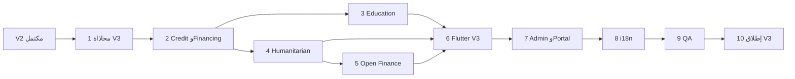

# خطة بناء Beza Platform — V3 (Tier D + منصة مفتوحة)

## سلسلة الخطط

| الإصدار | النطاق | الملف |
|---------|--------|--------|
| V0 | أسس، شرح، تجهيز | [خطة V0](.cursor/plans/خطة_بناء_beza_v0_الأسس.plan.md) |
| V1 | Tier A — محفظة، وكيل، FX، احتيال قواعد، حوالات، فواتير، تاجر QR | [خطة V1](.cursor/plans/خطة_بناء_beza_v1_152cd23a.plan.md) |
| V2 | Tier B+C + منصة (رواتب، ادخار، تسوية، بطاقات، ولاء، حكومي، POS، Fraud ML) | [`.cursor/plans/خطة_بناء_beza_v2_69780e8a.plan.md`](.cursor/plans/خطة_بناء_beza_v2_69780e8a.plan.md) |
| **V3** | **Tier D** + عناصر V3 من [`02-v1-scope.md`](.opencode/docs/roadmap/02-v1-scope.md) | هذا المستند |
| V4 | Tier E: Marketplace, Escrow, Takaful, Investments | [خطة V4](.cursor/plans/خطة_بناء_beza_v4_7cc85ffd.plan.md) |
| V5+ | توسعة إقليمية، social commerce | لاحق |

**شرط البدء:** إغلاق V2 بالكامل (مهام v2-task-1 → v2-task-14): إنتاج 14 يوماً، CreditScore API من V2 (9.3) جاهز، ≥12 شهر بيانات معاملات للتمويل حيث ينطبق.

---

## نطاق V3

### داخل V3 (Tier D — أشهر 17–24 في [`01-product-prioritization.md`](.opencode/docs/roadmap/01-product-prioritization.md))

| منتج | القيمة | تبعيات |
|------|--------|---------|
| **Financing** | مرابحة، قرض حسن، تمويل منشآت صغيرة، BNPL | تاريخ محفظة 12+ شهر، CreditScore، Sharia board، ترخيص CBS أو بنك شريك |
| **Education** | رسوم مدارس وجامعات، تسجيل، إيصالات | Bills/Wallet، تكامل مؤسسات |
| **Humanitarian** | صرف UN/NGO (WFP/UNHCR)، cash-for-work، ميزانيات برامج | Wallet, Agent, OFAC/UN استثناءات |
| **Open Finance** | OAuth2، APIs، webhooks، sandbox، بوابة مطورين | كل V1–V2 APIs مستقرة |

### داخل V3 (منصة — من NOT IN V1)

- لغات إضافية: كردي، أرمني ([`02-v1-scope.md`](.opencode/docs/roadmap/02-v1-scope.md) سطر 218)
- BNPL كمنتج (كان مذكوراً V2 في scope القديم — **يُنفَّذ في V3** مع Financing بعد CreditScore)
- رحلات تشغيلية مفقودة كملفات: 10–15 من [`03-user-journeys-index.md`](.opencode/docs/execution/03-user-journeys-index.md) — تُوثَّق وتُختبر حيث لم تُغطَ في V1/V2

### خارج V3 (صريح)

| عنصر | السبب |
|------|--------|
| **Marketplace / متجر طرف ثالث** | [`ADR-007-marketplace-deferred.md`](.opencode/docs/adr/ADR-007-marketplace-deferred.md) → V4+ |
| **Crypto / stablecoin** | مرفوض تنظيمياً — v1 exclusions |
| **P2P lending بين غرباء** | مرفوض استراتيجياً — v1 exclusions |
| **Takaful / Investments** | Tier E (24+ شهر) |
| **iOS/Android ميزات أساسية** | أُنجزت في V2 |

### الوضع الحالي في الكود

| Module | مسار | حالة |
|--------|------|------|
| Financing | [`app/Modules/Financing/`](app/Modules/Financing/) | skeleton: apply→approve→disburse→repay |
| Education | [`app/Modules/Education/`](app/Modules/Education/) | institution→student→fee |
| Humanitarian | [`app/Modules/Humanitarian/`](app/Modules/Humanitarian/) | org→program→disbursement |
| OpenFinance | [`app/Modules/OpenFinance/`](app/Modules/OpenFinance/) | OAuth app/consent/token |
| Mobile | hub screens فقط | يحتاج flows كاملة |

---

## مصادر الحقيقة

| المصدر | المسار |
|--------|--------|
| Feature Bibles | [`financing/`](.opencode/features/financing/), [`education/`](.opencode/features/education/), [`humanitarian/`](.opencode/features/humanitarian/), [`open-finance/`](.opencode/features/open-finance/) |
| AI / scoring | [`ai-platform/01-ai-architecture.md`](.opencode/docs/ai-platform/01-ai-architecture.md) |
| مالي | [`financial-core/`](.opencode/docs/financial-core/), [`06-ledger-impact-matrix.md`](.opencode/docs/execution/06-ledger-impact-matrix.md) |
| OpenAPI | [`docs/openapi.yaml`](docs/openapi.yaml) — توسيع tags V3 |
| DoD / Guardrails | [`10-definition-of-done.md`](.opencode/docs/engineering/10-definition-of-done.md), G-001–G-010 |
| امتثال | [`shared/compliance/`](.opencode/shared/compliance/) إن وُجد |

---

## ترتيب التنفيذ

**لا تبدأ 4 (Humanitarian) قبل 2.4 (امتثال OFAC/UN). لا تبدأ 5 (Open Finance) قبل استقرار APIs V1–V2.**

---

## 1 — محاذاة V3 والامتثال (أسبوع 1–2)

### 1.1 توثيق
- 1.1.1 إنشاء [`.opencode/docs/roadmap/04-v3-scope.md`](.opencode/docs/roadmap/04-v3-scope.md) (checklist مثل v1/v2 scope).
- 1.1.2 تحديث `docs/openapi.yaml`: Financing, Education, Humanitarian, OpenFinance, Developer.
- 1.1.3 ledger impact matrix لكل منتج Tier D.
- 1.1.4 كتابة ملفات الرحلات الناقصة: `journeys/10-agent-float-topup.md` … `15-account-freeze.md` (إن لم تُنجز في V2).

### 1.2 تراخيص وشراكات
- 1.2.1 CBS: ترخيص إقراض أو عقد بنك شريك (murabaha).
- 1.2.2 Sharia Supervisory Board: اعتماد منتجات التمويل الثلاثة + BNPL.
- 1.2.3 وزارة التربية: إطار تكامل مدارس/جامعات.
- 1.2.4 UN/NGO: اتفاقيات WFP/UNHCR + OFAC general license حيث يلزم USD.
- 1.2.5 CBS regulatory sandbox لـ Open Finance.

### 1.3 CI وFeature flags
- 1.3.1 CI jobs: `financing`, `education`, `humanitarian`, `openfinance`.
- 1.3.2 flags: `financing_enabled`, `education_enabled`, `humanitarian_enabled`, `open_api_enabled`.

**إغلاق 1:** `04-v3-scope.md` معتمد + عقود API مراجعة + flags.

---

## 2 — التمويل والائتمان (أسابيع 3–10)

**مرجع:** [`financing/00-index.md`](.opencode/features/financing/00-index.md) — Qard Hasan, Murabaha, Micro-Enterprise, BNPL.

### 2.1 محرك الائتمان (يبني على V2 CreditScore)
- 2.1.1 نموذج scoring: حجم معاملات، انتظام، tier KYC، عمر الحساب، fraud history.
- 2.1.2 حدود عرض تلقائي + رفض مع أسباب (AR/EN).
- 2.1.3 تخزين قرارات audit للامتثال.

### 2.2 منتجات التمويل — Backend
- 2.2.1 **Murabaha:** تسعير cost-plus، جدول أقساط، CFE posting (principal + markup منفصلين في الدفتر).
- 2.2.2 **Qard Hasan:** 0%، مدة قصيرة، سقف منخفض.
- 2.2.3 **Micro-Enterprise:** تدفق نقدي من محفظة + مستندات.
- 2.2.4 دورة حياة: apply → under_review → approved → disbursed → active → completed / defaulted.
- 2.2.5 **BNPL:** تقسيط على مشتريات تاجر (merchant QR) — 3/6 أقساط، رسوم شفافة.
- 2.2.6 تحصيل: auto-debit محفظة يوم الاستحقاق + تذكير SMS + grace period.
- 2.2.7 تأخر السداد: رسوم تأخير وفق Sharia policy + تصعيد collections (لا فوائد ربوية).

### 2.3 إدارة مخاطر التمويل
- 2.3.1 حدود تعرض إجمالية per user + per product.
- 2.3.2 تكامل Fraud ML (V2) لطلبات التمويل.
- 2.3.3 تقارير CBS للقروض (شهري).

### 2.4 Admin Financing
- 2.4.1 queue موافقات، override، شطب، إعادة جدولة.
- 2.4.2 لوحة محفظة قروض (NPL ratio).

### 2.5 Mobile Financing
- 2.5.1 `/financing`: استكشاف منتجات، طلب، حالة، جدول سداد، دفع قسط.
- 2.5.2 BNPL عند checkout تاجر (deep link من merchant flow).

### 2.6 اختبارات
- 2.6.1 E2E: apply murabaha → approve → disburse → repay كامل عبر CFE.
- 2.6.2 رفض عند score دون العتبة.

**إغلاق 2:** منتج murabaha واحد على الأقل في إنتاج staging + BNPL تجريبي مع تاجر واحد.

---

## 3 — التعليم (أسابيع 11–14)

**مرجع:** [`education/00-INDEX.md`](.opencode/features/education/00-INDEX.md), `11-USER-FLOWS.md`.

### 3.1 Backend
- 3.1.1 هرمية: `EducationInstitution` → `Student` → `EducationFee`.
- 3.1.2 استعلام رسوم (رقم طالب / رقم قيد) + دفع جزئي + رقم إيصال.
- 3.1.3 تكامل ERP مدرسة (CSV/API adapter — Phase 1 CSV bulk import).
- 3.1.4 أحداث: `StudentRegistered`, `FeePaid` — موجودة، ربط Notification.

### 3.2 بوابة مؤسسة (ويب)
- 3.2.1 `/institution/dashboard`: رفع دفعات، تقارير تحصيل، طلاب متأخرون.
- 3.2.2 أو Admin فرع `/admin/education/institutions`.

### 3.3 Mobile
- 3.3.1 `/education`: بحث مؤسسة → طالب → فاتورة → دفع PIN → إيصال PDF.
- 3.3.2 تذكير استحقاق (push/SMS) — من Bible `28-AI-FEATURES` تذكيرات ذكية (قواعد أولاً).

### 3.4 امتثال
- 3.4.1 لا تخزين درجات حساسة — رسوم فقط.
- 3.4.2 إيصال مع QR للتحقق في المدرسة.

**إغلاق 3:** دفع رسوم مدرسة ثانوية E2E (mock institution في staging).

---

## 4 — المساعدات الإنسانية (أسابيع 15–19)

**مرجع:** [`humanitarian/00-index.md`](.opencode/features/humanitarian/00-index.md).

### 4.1 Backend
- 4.1.1 `Organization` → `Program` → `Disbursement` + تتبع ميزانية.
- 4.1.2 batch disbursement لآلاف مستفيدين (queue chunked).
- 4.1.3 voucher vs cash-to-wallet — مساران.
- 4.1.4 auto-decrement budget على `DisbursementCompleted`.
- 4.1.5 استلام عبر وكيل للمستفيدين بلا هاتف (SMS code).

### 4.2 امتثال وامتثال دولي
- 4.2.1 فحص OFAC/UN لكل batch beneficiary list.
- 4.2.2 فصل بيانات المستفيدين (تشفير، وصول NGO فقط).
- 4.2.3 تقارير مانحين (UN format CSV).

### 4.3 بوابة NGO
- 4.3.1 `/ngo/programs`: إنشاء برنامج، رفع قائمة مستفيدين، مراقبة صرف.
- 4.3.2 موافقة Beza compliance قبل التفعيل.

### 4.4 Mobile (مستفيد)
- 4.4.1 إشعار استلام مساعدة + تفاصيل برنامج (بدون بيانات حساسة للمانح).
- 4.4.2 سحب وكيل / استخدام فوري.

### 4.5 Admin
- 4.5.1 مراقبة برامج نشطة، إنذار تجاوز ميزانية 90%.

**إغلاق 4:** batch 100 مستفيد E2E + تقرير UN template.

---

## 5 — Open Finance وبوابة المطورين (أسابيع 20–24)

**مرجع:** [`open-finance/01-vision.md`](.opencode/features/open-finance/01-vision.md), كود [`OpenFinance`](app/Modules/OpenFinance/).

### 5.1 OAuth2 وموافقات
- 5.1.1 `Application` → `Consent` → `Token` (scope: read_balance, initiate_payment, …).
- 5.1.2 TTL 2h + refresh rotation — موجود، إكمال revocation.
- 5.1.3 واجهة موافقة مستخدم في التطبيق (شاشة scopes AR).

### 5.2 APIs عامة (P0 من الرؤية)
- 5.2.1 Payment Initiation (P2P, bulk, merchant).
- 5.2.2 Account Information (balance, transactions paginated).
- 5.2.3 Wallet API (create للشركاء B2B — بموافقة).
- 5.2.4 Webhooks: HMAC signed, retry, idempotency.
- 5.2.5 Rate limiting per developer tier.

### 5.3 Sandbox
- 5.3.1 بيئة `sandbox.beza.app` — بيانات وهمية، لا أموال حقيقية.
- 5.3.2 مفاتيح test/live منفصلة.

### 5.4 Developer Portal
- 5.4.1 موقع `developers.beza.app`: docs (OpenAPI render), playground, keys, webhooks log.
- 5.4.2 onboarding مطور: KYC شركة + اتفاقية API.

### 5.5 امتثال
- 5.5.1 CMT/data privacy — سياسة بيانات طرف ثالث.
- 5.5.2 CBS sandbox تقارير ربع سنوية.

**إغلاق 5:** تطبيق sandbox يمرّ OAuth + initiate payment وهمي + webhook received.

---

## 6 — Flutter V3 (أسابيع 25–28)

### 6.1 بنية
- 6.1.1 features كاملة: `financing`, `education`, `humanitarian` (مستفيد), `developer_consent`.
- 6.1.2 Router + deep links (إيصال تعليم، قبول OAuth).

### 6.2 شاشات (من Bibles 08/11/18)
- 6.2.1 Financing: product catalog, application wizard, loan detail, repayment, BNPL checkout.
- 6.2.2 Education: institution search, fee inquiry, partial pay, receipt.
- 6.2.3 Humanitarian: benefit notification, program info (read-only).
- 6.2.4 OAuth consent screen (Open Finance).

### 6.3 اختبارات
- 6.3.1 integration لمسار financing + education.
- 6.3.2 RTL لكل النصوص الجديدة.

**إغلاق 6:** 100% مسارات V3 في router ضد staging.

---

## 7 — Admin V3 + بوابات B2B (أسبوع 29–30)

### 7.1 Admin
- 7.1.1 Financing ops, Education institutions, Humanitarian programs, API applications.
- 7.1.2 Open Finance: مطورون، مفاتيح، إبطال، usage metrics.
- 7.1.3 تقارير: NPL, school collection rate, NGO disbursement SLA.

### 7.2 بوابات منفصلة (اختياري monorepo)
- 7.2.1 `institution-portal/` — تعليم.
- 7.2.2 `ngo-portal/` — إنساني.
- 7.2.3 `developers/` — أو static site منفصل.

**إغلاق 7:** Ops + شريك واحد لكل بوابة على staging.

---

## 8 — تدويل موسّع (أسبوع 31)

**مرجع:** v1-scope Kurdish/Armenian → V3.

### 8.1 l10n
- 8.1.1 `app_ku.arb`, `app_hy.arb` — كل نصوص V3 + مراجعة متحدث أصلي.
- 8.1.2 USSD/SMS قوالب للغات الثلاث حيث ينطبق.

**إغلاق 8:** تبديل لغة كامل في financing + education flows.

---

## 9 — QA والأمان V3 (أسبوع 32)

### 9.1 اختبارات
- 9.1.1 Pest: Financing, Education, Humanitarian, OpenFinance — feature + integration.
- 9.1.2 E2E HTTP: قرض كامل، رسوم مدرسة، batch إنساني 50، OAuth payment sandbox.
- 9.1.3 Regression V1+V2 (حزمة smoke يومية).

### 9.2 أمان
- 9.2.1 pen test: OAuth, institution upload, NGO bulk files.
- 9.2.2 OWASP API Security Top 10 على Open Finance.
- 9.2.3 مراجعة Sharia + AML لمسارات التمويل.

### 9.3 أداء
- 9.3.1 humanitarian batch 10K beneficiaries < 30 min.
- 9.3.2 open API 100 RPS sustained (tier enterprise).

**إغلاق 9:** zero P0; Sharia sign-off موثق.

---

## 10 — إطلاق V3 (أسبوع 33)

### 10.1 نشر مرحلي
- 10.1.1 Education → Humanitarian (pilot NGO واحد) → Financing (limited geography) → Open Finance (sandbox public ثم production keys).
- 10.1.2 Feature flags per governorate.

### 10.2 تشغيل
- 10.2.1 runbooks جديدة: default loan, NGO batch failure, API key compromise.
- 10.2.2 تحديث [`08-production-readiness.md`](.opencode/docs/execution/08-production-readiness.md) لبنود Tier D.
- 10.2.3 KPIs: [`02-kpi-catalog.md`](.opencode/docs/operations/02-kpi-catalog.md) — loan book, fee collection GMV, API partners, beneficiaries served.

### 10.3 ما بعد V3
- 10.3.1 kickoff V4 planning: Marketplace (شروط ADR-007), Takaful — **لا تنفيذ في V3**.

**إغلاق V3:** 14 يوم إنتاج لكل منتج مفعّل + تقرير CBS ربع سنوي Open Finance.

---

## تقدير زمني

| المهمة | أسابيع |
|--------|--------|
| 1 | 2 |
| 2 | 8 |
| 3 | 4 |
| 4 | 5 |
| 5 | 5 |
| 6 | 4 |
| 7 | 2 |
| 8 | 1 |
| 9 | 1 |
| 10 | 1 |
| **المجموع** | **~33 أسبوع** (~8 أشهر بعد V2) |

يتوافق مع roadmap Tier D (أشهر 17–24) بعد اكتمال V1+V2.

---

## ربط Feature Bibles

| مهمة | مجلد |
|------|------|
| 2 | `.opencode/features/financing/` |
| 3 | `.opencode/features/education/` |
| 4 | `.opencode/features/humanitarian/` |
| 5 | `.opencode/features/open-finance/` |

---

## مخاطر V3

| خطر | تخفيف |
|-----|--------|
| تأخر ترخيص إقراض | partnership bank + Qard Hasan فقط أولاً |
| OFAC لبرامج USD | قنوات SYP أولاً؛ USD بترخيص صريح |
| تكامل مدارس بطيء | CSV manual + 5 مدارس pilot |
| Open API إساءة | rate limits + مراجعة مطور + sandbox |
| NPL تمويل | حدود محافظة + scoring محافظ في الإطلاق |

---

## تحديث خطة V2

في [خطة V2](.cursor/plans/خطة_بناء_beza_v2_69780e8a.plan.md) استبدال سطر «V3 — خطة لاحقة» برابط: [خطة_بناء_beza_v3](.cursor/plans/خطة_بناء_beza_v3_*.plan.md) بعد إنشاء الملف.
