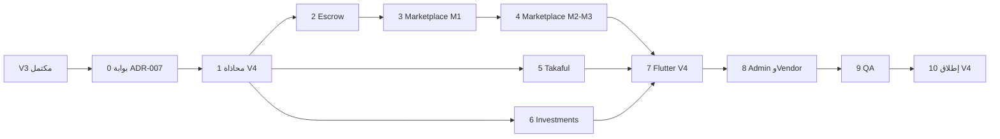

# خطة بناء Beza Platform — V4 (Tier E — Super App Ecosystem)

## سلسلة الخطط

| الإصدار | النطاق | الملف |
|---------|--------|--------|
| V0 | أسس وتجهيز | [خطة V0](.cursor/plans/خطة_بناء_beza_v0_الأسس.plan.md) |
| V1 | Tier A | [خطة V1](.cursor/plans/خطة_بناء_beza_v1_152cd23a.plan.md) |
| V2 | Tier B + C + منصة | [خطة V2](.cursor/plans/خطة_بناء_beza_v2_69780e8a.plan.md) |
| V3 | Tier D | [خطة V3](.cursor/plans/خطة_بناء_beza_v3_7f921b42.plan.md) |
| **V4** | **Tier E** | هذا المستند |
| V5 | توسعة إقليمية، social commerce، white-label، AI | [خطة V5](.cursor/plans/خطة_بناء_beza_v5_e4ef8424.plan.md) |
| V6+ | multi-DC، منتجات رأس مال موسعة | لاحق |

**شرط البدء العام:** إغلاق V3 (v3-task-1 → v3-task-10) — Open Finance مستقر، Financing في إنتاج، ≥12 شهر تشغيل منذ V1.

---

## بوابة Go/No-Go (إلزامية قبل المهمة 2)

من [`ADR-007-marketplace-deferred.md`](.opencode/docs/adr/ADR-007-marketplace-deferred.md) — **لا يبدأ بناء Marketplace إلا بعد تحقق الكل:**

| # | شرط | مقياس |
|---|------|--------|
| G1 | محافظ نشطة | ≥ 100,000 |
| G2 | تجار نشطون | ≥ 5,000 |
| G3 | حجم يومي | > 500M SYP/يوم |
| G4 | فريق | فريق Marketplace مخصص (PM + 2 backend + 2 mobile + 1 ops) |

**Takaful و Investments** يمكنان البدء بالتوازي مع Marketplace **بعد** V3 إذا كانت التراخيص جاهزة — لا يتطلبان G1–G4 بالكامل، لكن يتطلبان تراخيص CBS/هيئة سوق رأس المال منفصلة.

---

## نطاق V4

### داخل V4 (Tier E — [`01-product-prioritization.md`](.opencode/docs/roadmap/01-product-prioritization.md))

| منتج | الوصف | تبعيات |
|------|--------|---------|
| **Marketplace** | سوق رقمي داخل Super App: شحن، باقات، بطاقات هدايا، سلع رقمية، لاحقاً سلع مادية | Wallet, CFE, Bills (إعادة استخدام adapters), Loyalty V2, Merchant V1, Escrow |
| **Escrow** | ضمان معاملات عالية القيمة (سوق + B2B) — مؤجل مع Marketplace في ADR-007 | CFE suspense accounts |
| **Takaful (تأمين تكافلي)** | منتجات تأمين متوافقة شرعياً | CBS insurance license, Sharia board, actuarial |
| **Investments** | صناديق/محافظ استثمار retail (حلال فقط) | Capital Market Authority, 12+ شهر بيانات، Tier 3 users |

### مراحل Marketplace الداخلية (من [`marketplace/30-future-roadmap.md`](.opencode/features/marketplace/30-future-roadmap.md))

| مرحلة V4 | محتوى | توقيت تقريبي داخل V4 |
|----------|--------|----------------------|
| **M1** | Top-up رقمي، سلع رقمية، دفع محفظة hold/release | أسابيع 4–12 |
| **M2** | بطاقات هدايا، promos، نقاط ولاء | أسابيع 13–18 |
| **M3** | سلع مادية، شحن، COD، تسجيل بائع مفتوح | أسابيع 19–28 |
| **M4** | Marketplace API للشركاء (يبني على Open Finance V3) | أسابيع 29–32 |

### خارج V4 (صريح)

| عنصر | السبب |
|------|--------|
| Crypto / USDT / NFT | مرفوض — v1 exclusions + تعارض مع CBS |
| P2P gift card trading | مخاطر احتيال — تأجيل V5+ |
| Social commerce / group buying | V5+ في bible roadmap |
| توسعة إقليمية (لبنان/العراق) | V5+ |
| P2P lending بين غرباء | مرفوض دائماً |

### الوضع الحالي

- **لا يوجد** `app/Modules/Marketplace/` — بناء من الصفر.
- توثيق: [`.opencode/features/marketplace/`](.opencode/features/marketplace/) — 31 ملف (overview → API → schema → financial flows).
- Takaful / Investments: **لا feature bible** — تُنشأ في المهمة 1.1.

---

## مصادر الحقيقة

| المصدر | المسار |
|--------|--------|
| Marketplace Bible | `.opencode/features/marketplace/01`–`30` |
| ADR | [`ADR-007`](.opencode/docs/adr/ADR-007-marketplace-deferred.md) |
| Sharia | [`shared/compliance/03-sharia.md`](.opencode/shared/compliance/03-sharia.md) |
| Product catalog | [`financial-core/05-product-catalog.md`](.opencode/docs/financial-core/05-product-catalog.md) (escrow fees) |
| Guardrails / DoD | G-001–G-010, [`10-definition-of-done.md`](.opencode/docs/engineering/10-definition-of-done.md) |
| Loyalty integration | [`features/loyalty/`](.opencode/features/loyalty/) |
| Open Finance | V3 developer portal |

---

## ترتيب التنفيذ

---

## 0 — تقييم الجاهزية (أسبوع 1)

### 0.1 مقاييس ADR
- 0.1.1 لوحة KPI: active wallets, merchants, daily SYP volume (من [`02-kpi-catalog.md`](.opencode/docs/operations/02-kpi-catalog.md)).
- 0.1.2 تقرير Go/No-Go موقع من الإدارة — إن فشل شرط → تأجيل Marketplace فقط، متابعة Takaful/Investments إن التراخيص جاهزة.

### 0.2 قرار المنتج
- 0.2.1 نطاق M1 فقط للإطلاق الأول إن كانت G3 قريبة لكن G4 غير مكتمل (تقليل المخاطر).

**إغلاق 0:** محضر موافقة مكتوب.

---

## 1 — محاذاة V4 (أسبوع 2)

### 1.1 توثيق
- 1.1.1 إنشاء [`.opencode/docs/roadmap/05-v4-scope.md`](.opencode/docs/roadmap/05-v4-scope.md).
- 1.1.2 إنشاء feature bibles مسودة: `.opencode/features/takaful/` و `.opencode/features/investments/` (هيكل 30 ملف مبسط أو 15 ملف أساسي).
- 1.1.3 `docs/openapi.yaml`: tags Marketplace, Escrow, Takaful, Investments.
- 1.1.4 ledger impact matrix — escrow holds، commission income، premium flows.

### 1.2 تنظيمي
- 1.2.1 وزارة الاقتصاد — تسجيل منصة تجارة إلكترونية.
- 1.2.2 CBS: ترخيص تأمين (منفصل عن payments).
- 1.2.3 هيئة سوق رأس المال: ترخيص أو شراكة صندوق استثمار.
- 1.2.4 Sharia board: اعتماد Takaful + صناديق استثمار.

### 1.3 هندسة
- 1.3.1 قرار: Marketplace كـ **`app/Modules/Marketplace/`** داخل modular monolith (متوافق ADR-002، ليس microservice منفصل رغم ذكر bible لـ microservice — **الالتزام بالـ monolith**).
- 1.3.2 CI modules: `marketplace`, `escrow`, `takaful`, `investments`.
- 1.3.3 feature flags: `marketplace_m1`, `physical_goods`, `takaful`, `investments`.

**إغلاق 1:** `05-v4-scope.md` + openapi draft + flags.

---

## 2 — Escrow (أسابيع 3–5)

**مرجع:** product catalog escrow fees، [`marketplace/19-financial-flows.md`](.opencode/features/marketplace/19-financial-flows.md) للمعاملات عالية القيمة.

### 2.1 Backend (`app/Modules/Escrow/` أو ضمن Marketplace subdomain)
- 2.1.1 اتفاقية escrow: buyer, seller, amount, milestones, expiry.
- 2.1.2 CFE: hold → release / refund عبر suspense (2700).
- 2.1.3 رسوم: 1% capped 50K SYP (B2C) من catalog.
- 2.1.4 نزاع: فتح case → Admin resolution → release/refund.

### 2.2 تكامل
- 2.2.1 إتاحة Escrow لـ Merchant B2B ولـ Marketplace M3 فقط في البداية.
- 2.2.2 أحداث: `EscrowCreated`, `EscrowReleased`, `EscrowDisputed`.

### 2.3 Admin
- 2.3.1 queue نزاعات escrow.

**إغلاق 2:** escrow B2B تجريبي E2E عبر CFE.

---

## 3 — Marketplace M1: رقمي فوري (أسابيع 6–14)

**مرجع:** [`01-marketplace-overview.md`](.opencode/features/marketplace/01-marketplace-overview.md), [`15-backend-api.md`](.opencode/features/marketplace/15-backend-api.md), [`16-database-schema.md`](.opencode/features/marketplace/16-database-schema.md).

### 3.1 Backend — نواة
- 3.1.1 migrations: `vendors`, `products`, `categories`, `orders`, `order_items`, `fulfillments`.
- 3.1.2 catalog service: CRUD منتجات رقمية، أسعار، مخزون رقمي.
- 3.1.3 order state machine: cart → paid → fulfilling → completed / failed / refunded.
- 3.1.4 payment: CFE hold على المحفظة → fulfill → capture؛ فشل → release.

### 3.2 Fulfillment
- 3.2.1 adapters Syriatel/MTN top-up (إعادة استخدام Bills مع عقد marketplace commission).
- 3.2.2 pipeline سلع رقمية: game credits, streaming codes — queue + retry.
- 3.2.3 settlement أسبوعي مع المشغلين (من financial flows).

### 3.3 Vendor (invite-only)
- 3.3.1 [`25-vendor-onboarding.md`](.opencode/features/marketplace/25-vendor-onboarding.md): KYC بائع، عقد عمولة.
- 3.3.2 portal بائع v1: منتجات، طلبات، تقارير مبيعات.

### 3.4 Commission
- 3.4.1 [`24-commission-system.md`](.opencode/features/marketplace/24-commission-system.md): 8–15% configurable per category.
- 3.4.2 posting عمولة إلى 3100 Fee Income.

### 3.5 Fraud ودعم
- 3.5.1 قواعد: velocity شراء رقمي، chargeback pattern.
- 3.5.2 dispute مرتبط بـ [`journeys/08-dispute-resolution.md`](.opencode/docs/journeys/08-dispute-resolution.md).

**إغلاق 3:** شراء top-up 10,000 SYP من تبويب Marketplace E2E.

---

## 4 — Marketplace M2 + M3 (أسابيع 15–28)

### 4.1 M2 — هدايا ومكافآت (أسابيع 15–18)
- 4.1.1 [`26-gift-card-system.md`](.opencode/features/marketplace/26-gift-card-system.md): شراء، إرسال SMS/WhatsApp، QR استرداد.
- 4.1.2 portal استرداد تاجر.
- 4.1.3 تكامل Loyalty V2: نقاط على كل شراء marketplace.
- 4.1.4 محرك promo codes v2.

### 4.2 M3 — سلع مادية (أسابيع 19–28)
- 4.2.1 منتجات فيزيائية: مخزون، عناوين توصيل (14 محافظة).
- 4.2.2 شركاء logistics (3PL adapter — عقود محلية).
- 4.2.3 COD: تحصيل عند التسليم عبر وكيل أو مندوب.
- 4.2.4 تتبع شحنة + إشعارات حالة.
- 4.2.5 تسجيل بائع self-serve (فتح [`25-vendor-onboarding.md`](.opencode/features/marketplace/25-vendor-onboarding.md)).
- 4.2.6 Escrow إلزامي لطلبات > حد (مثلاً 500K SYP).

### 4.3 M4 — API (أسابيع 29–32، يمكن موازاة 4.2)
- 4.3.1 Marketplace endpoints في Open Finance: catalog, order, webhook fulfillment.
- 4.3.2 rate limits منفصلة عن core wallet.

**إغلاق 4:** مسار هدية + طلب مادي واحد COD على staging.

---

## 5 — Takaful (أسابيع 8–16، موازي بعد 1)

**لا bible حالياً — يُبنى من الصفر.**

### 5.1 منتجات
- 5.1.1 تكافل صحي أساسي، تأمين جهاز (هاتف)، تأمين سفر (داخل سوريا/خارج حسب ترخيص).
- 5.1.2 هيكل: contribution (اشتراك) + tabarru' pool — لا riba.
- 5.1.3 underwriting rules مبسطة V4 (استبعاد pre-existing حسب policy).

### 5.2 Backend (`app/Modules/Takaful/`)
- 5.2.1 policies, claims, premiums debit من المحفظة.
- 5.2.2 CFE: premium → pool account؛ claim payout من pool.
- 5.2.3 شريك شركة تأمين مرخصة (API أو batch يومي).

### 5.3 Mobile
- 5.3.1 `/takaful`: استكشاف، اشتراك، بوليصة، مطالبة (claim upload).

### 5.4 Admin
- 5.4.1 موافقة claims، تقارير loss ratio.

**إغلاق 5:** اشتراك + claim mock approved E2E.

---

## 6 — Investments (أسابيع 10–18، موازي)

### 6.1 منتجات (حلال فقط — [`03-sharia.md`](.opencode/shared/compliance/03-sharia.md))
- 6.1.1 صندوق محافظ محافظ (Sukuk-like أو equity compliant funds عبر شريك).
- 6.1.2 حد أدنى استثمار — Tier 3 فقط.
- 6.1.3 لا derivatives، لا short، لا spec crypto.

### 6.2 Backend (`app/Modules/Investments/`)
- 6.2.1 subscribe / redeem units (T+2 settlement).
- 6.2.2 NAV يومي من شريك الصندوق.
- 6.2.3 CFE: debit wallet → investment liability account.
- 6.2.4 Zakat calculator integration (موجود concept في sharia doc) — عرض تقديري.

### 6.3 Mobile
- 6.3.1 `/investments`: عرض NAV، اشتراك، استرداد، تاريخ.

### 6.4 Admin
- 6.4.1 reconciliation مع شريك الصندوق.

**إغلاق 6:** اشتراك 100K SYP واسترداد جزئي E2E staging.

---

## 7 — Flutter V4 (أسابيع 30–34)

### 7.1 Super App tab
- 7.1.1 تبويب **Marketplace** رئيسي في bottom nav أو More → promoted.
- 7.1.2 IA من [`10-information-architecture.md`](.opencode/features/marketplace/10-information-architecture.md).
- 7.1.3 شاشات: home categories, product detail, cart, checkout, order tracking, gift send.

### 7.2 Takaful + Investments
- 7.2.1 flows كاملة مع تصميم 2026 + إفصاح مخاطر AR.

### 7.3 Vendor app (اختياري Flutter منفصل `vendor_app/`)
- 7.3.1 طلبات، fulfillment scan، إحصائيات — من roadmap v2.0 vendor mobile.

**إغلاق 7:** مسارات M1+M2 في production build.

---

## 8 — Admin V4 + بوابات (أسابيع 35–36)

### 8.1 Admin
- 8.1.1 Marketplace: vendors, products moderation, orders, commissions, settlements.
- 8.1.2 Escrow disputes.
- 8.1.3 Takaful policies/claims.
- 8.1.4 Investments NAV, subscriptions queue.
- 8.1.5 [`28-analytics-reporting.md`](.opencode/features/marketplace/28-analytics-reporting.md): GMV, AOV, conversion.

### 8.2 Vendor portal web
- 8.2.1 `vendor.beza.app` — منفصل عن admin.

**إغلاق 8:** ops يدير vendor onboarding دون SQL.

---

## 9 — QA والأمان (أسبوع 37)

### 9.1 اختبارات
- 9.1.1 Pest: order lifecycle, escrow, commission math.
- 9.1.2 E2E: top-up, gift card, physical order COD, takaful subscribe, investment subscribe.
- 9.1.3 Regression V1–V3 smoke.

### 9.2 أمان
- 9.2.1 pen test marketplace checkout + vendor portal.
- 9.2.2 supply chain: vendor API keys rotation.

### 9.3 أداء
- 9.3.1 1000 orders/hour digital fulfillment.
- 9.3.2 catalog search < 200ms p95.

**إغلاق 9:** GMV محاكاة 1M SYP/ساعة دون فشل hold/release.

---

## 10 — إطلاق V4 (أسبوع 38)

### 10.1 نشر مرحلي
- 10.1.1 Takaful (محدود جغرافياً) + Investments (دعوة Tier 3) — إن التراخيص جاهزة.
- 10.1.2 Marketplace M1 → M2 → M3 حسب flags.
- 10.1.3 Escrow للتجار B2B قبل السلع المادية للمستهلك.

### 10.2 KPIs V4
- 10.2.1 GMV marketplace 750M SYP/month (هدف Y1 من overview).
- 10.2.2 MAU buyers 50K.
- 10.2.3 Digital delivery > 99.5%.
- 10.2.4 AUM investments + policies in force.

### 10.3 V5 kickoff
- 10.3.1 توسعة إقليمية، social commerce — **خارج نطاق V4**.

**إغلاق V4:** 14 يوم إنتاج لكل منتج مفعّل + ADR gates مستمرة للمرحلة M3.

---

## تقدير زمني

| المهمة | أسابيع | ملاحظة |
|--------|--------|--------|
| 0 | 1 | Go/No-Go |
| 1 | 1 | محاذاة |
| 2 | 3 | Escrow |
| 3 | 9 | Marketplace M1 |
| 4 | 18 | M2+M3+M4 (متداخل) |
| 5 | 9 | Takaful (موازي) |
| 6 | 9 | Investments (موازي) |
| 7 | 5 | Flutter |
| 8 | 2 | Admin/vendor |
| 9 | 1 | QA |
| 10 | 1 | Launch |
| **المجموع** | **~38–40 أسبوع** | ~9–10 أشهر بعد V3 |

---

## ربط Feature Bibles

| مهمة | مرجع |
|------|------|
| 2–4 | `.opencode/features/marketplace/` (01–30) |
| 5 | جديد `features/takaful/` + sharia compliance |
| 6 | جديد `features/investments/` + sharia permissible investments |

---

## مخاطر V4

| خطر | تخفيف |
|-----|--------|
| فشل بوابة ADR | إطلاق Takaful/Investments فقط؛ تأجيل Marketplace |
| تكرار Bills vs Marketplace top-up | unified fulfillment service؛ واجهة marketplace فقط |
| logistics سوريا | M1/M2 رقمي أولاً؛ M3 pilot دمشق/حلب |
| ترخيص تأمين/استثمار بطيء | شراكة B2B2C مع جهة مرخصة |
| bible يذكر microservice | الالتزام modular monolith + events |

---

## تحديث خطة V3

مرتبطة بـ [خطة V3](.cursor/plans/خطة_بناء_beza_v3_7f921b42.plan.md) وسلسلة V1–V2.
