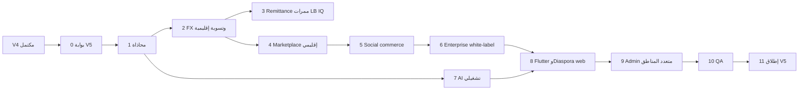

# خطة بناء Beza Platform — V5 (توسعة إقليمية ومنصة ناضجة)

## سلسلة الخطط

| الإصدار | النطاق | الملف |
|---------|--------|--------|
| V0 | أسس، شرح، تجهيز، فجوات | [خطة V0](.cursor/plans/خطة_بناء_beza_v0_الأسس.plan.md) |
| V1 | Tier A — البنية المالية الأساسية | [خطة V1](.cursor/plans/خطة_بناء_beza_v1_152cd23a.plan.md) |
| V2 | Tier B + C | [خطة V2](.cursor/plans/خطة_بناء_beza_v2_69780e8a.plan.md) |
| V3 | Tier D | [خطة V3](.cursor/plans/خطة_بناء_beza_v3_7f921b42.plan.md) |
| V4 | Tier E — Marketplace, Escrow, Takaful, Investments | [خطة V4](.cursor/plans/خطة_بناء_beza_v4_7cc85ffd.plan.md) |
| **V5** | **إقليم + ecosystem** | هذا المستند |
| V6+ | رؤية 2030 (اختياري) | لاحق |

**شرط البدء:** إغلاق V4 (v4-task-0 → v4-task-10) — Marketplace M1+ في إنتاج، GMV يقترب من أهداف overview (750M SYP/شهر)، Open Finance مستقر، بوابة ADR-007 محققة ومستمرة.

---

## نطاق V5 — ماذا يدخل

### من [`marketplace/30-future-roadmap.md`](.opencode/features/marketplace/30-future-roadmap.md) (v2.1 + v2.2 المسموح)

| محور | محتوى |
|------|--------|
| **إقليمي — اتصالات** | لبنان (Alfa, Touch)، العراق (Zain, Asiacell, Korek) — شحن وباقات عبر Marketplace |
| **إقليمي — هدايا** | بطاقات هدايا UAE/KSA/Jordan، إهداء عبر الحدود |
| **إقليمي — مالي** | تسوية إقليمية متعددة العملات (SYP/USD/LBP/IQD) مع FX V2 |
| **إقليمي — حوالات** | ممرات Remittance إضافية (LB, IQ) للجالية |
| **Social commerce** | سلة مشتركة، شراء جماعي (group buy) |
| **سوق متقدم** | P2P تداول بطاقات هدايا (ضوابط احتيال)، white-label marketplace للمؤسسات |
| **تشغيل ذكي** | مساعد بائع AI (تسعير، إتمام)، توصيات منتجات |
| **تكامل مؤسسي** | مزامنة مخزون ERP للبائعين في الوقت الفعلي |
| **لغات** | تركي (+ إكمال كردي إن لم يُغلق في V3) |
| **منصة** | Diaspora web كامل (إرسال حوالات + marketplace للمغتربين) |

### خارج V5 (مرفوض أو مؤجل)

| عنصر | السبب |
|------|--------|
| Crypto / USDT / NFT receipts | [`02-v1-scope.md`](.opencode/docs/roadmap/02-v1-scope.md) exclusions + CBS |
| منتجات V4 الأساسية (Marketplace M1, Takaful, Investments) | أُنجزت في V4 |
| Gambling, alcohol, tobacco | استبعاد دائم |
| P2P lending بين غرباء | استبعاد استراتيجي |
| ترخيص تأمين/استثمار جديد | V4 — V5 يوسّع فقط |

---

## بوابة Go/No-Go لـ V5 (مهمة 0)

| # | شرط | مقياس |
|---|------|--------|
| R1 | نضج سوق سوريا | Marketplace GMV ≥ 500M SYP/شهر لـ 3 أشهر متتالية |
| R2 | شبكة | ≥ 50K MAU marketplace buyers (هدف Y1 من overview) |
| R3 | امتثال إقليمي | موافقة مبدئية LB/IQ للشحن الرقمي أو شريك مرخص محلي |
| R4 | بنية | FX + Settlement multi-currency جاهز من V4 |
| R5 | فريق | squad إقليمي (1 PM + 2 eng + 1 compliance) |

---

## مصادر الحقيقة

| المصدر | المسار |
|--------|--------|
| Marketplace توسعة | [`marketplace/27-telecom-integration.md`](.opencode/features/marketplace/27-telecom-integration.md), `30-future-roadmap.md` |
| Remittance | [`features/remittance/`](.opencode/features/remittance/) |
| FX | [`features/fx/`](.opencode/features/fx/) |
| AI | [`docs/ai-platform/01-ai-architecture.md`](.opencode/docs/ai-platform/01-ai-architecture.md) |
| رؤية المنصة | [`docs/product/01-vision-2026.md`](.opencode/docs/product/01-vision-2026.md) (Year 5 scale) |
| Sharia / استثمار | [`shared/compliance/03-sharia.md`](.opencode/shared/compliance/03-sharia.md) |

---

## ترتيب التنفيذ



---

## 0 — تقييم الجاهزية (أسبوع 1)

- 0.1 لوحة R1–R5 من KPIs الحية.
- 0.2 دراسة جدوى LB/IQ: عقود مشغلين، عقوبات، مسارات USD.
- 0.3 قرار: إطلاق LB أولاً أو IQ أولاً (غالباً LB للجالية السورية).

**إغلاق 0:** محضر Go/No-Go.

---

## 1 — محاذاة V5 (أسبوع 2)

### 1.1 توثيق
- 1.1.1 [`.opencode/docs/roadmap/06-v5-scope.md`](.opencode/docs/roadmap/06-v5-scope.md).
- 1.1.2 `docs/openapi.yaml`: `regional/*`, `social/*`, `enterprise/white-label`.
- 1.1.3 ADR جديد: `ADR-008-regional-expansion-strategy.md` (LB vs IQ، شريك محلي vs ترخيص مباشر).

### 1.2 بنية
- 1.2.1 `region` dimension على المستخدم/الطلب/التسوية (SY, LB, IQ).
- 1.2.2 feature flags per country.
- 1.2.3 CI: `regional`, `social-commerce`, `enterprise-marketplace`.

**إغلاق 1:** scope + ADR-008 معتمد.

---

## 2 — FX وتسوية إقليمية (أسابيع 3–6)

### 2.1 عملات وممرات
- 2.1.1 إضافة LBP, IQD كعملات عرض (ليس بالضرورة محفظة كاملة Day 1).
- 2.1.2 أسعار: CBS/SY + شريك LB + شريك IQ — fallback يدوي.
- 2.1.3 نوافذ قفل 15 ثانية لكل ممر (متوافق ADR-003).

### 2.2 Settlement
- 2.2.1 batch تسوية إقليمية: SY ↔ LB ↔ IQ عبر حسابات مراسلة.
- 2.2.2 تقارير FX P&L per corridor.
- 2.2.3 reconciliation يومي multi-currency.

**إغلاق 2:** تحويل SYP→LBP عرض سعر + تسوية وهمية E2E staging.

---

## 3 — Remittance ممرات إقليمية (أسابيع 5–8)

### 3.1 Backend
- 3.1.1 ممر LB: بيروت→دمشق (موجود جزئياً في V1 — تعميق).
- 3.1.2 ممر IQ: بغداد/أربيل→سوريا (عبر شريك MTO).
- 3.1.3 AML مزدوج: OFAC + قوائم محلية LB/IQ.

### 3.2 Diaspora Web (`diaspora.beza.app`)
- 3.2.1 تسجيل مرسل، KYC جواز، إرسال، تتبع.
- 3.2.2 دفع بطاقة/محفظة أجنبية عبر شريك (خارج نطاق CBS السوري المباشر).

**إغلاق 3:** إرسال $100 من LB corridor E2E sandbox.

---

## 4 — Marketplace إقليمي (أسابيع 7–14)

**مرجع:** [`27-telecom-integration.md`](.opencode/features/marketplace/27-telecom-integration.md).

### 4.1 Adapters
- 4.1.1 LB: Alfa, Touch top-up/bundles.
- 4.1.2 IQ: Zain, Asiacell, Korek.
- 4.1.3 فشل adapter → refund تلقائي CFE.

### 4.2 هدايا إقليمية
- 4.2.1 كتالوج merchants UAE/KSA/JO.
- 4.2.2 إهداء عبر الحدود + SMS بالعملة المحلية للمستلم.

### 4.3 Catalog geo
- 4.3.1 فلترة منتجات حسب `region` و IP/VPN policy (منع إساءة).

**إغلاق 4:** شراء شحن LB من مستخدم سوري مسافر أو من diaspora web (حسب منتج).

---

## 5 — Social Commerce (أسابيع 15–18)

### 5.1 Backend (`SocialCommerce` ضمن Marketplace أو module فرعي)
- 5.1.1 **Shared cart:** دعوة برابط، انضمام حتى N أعضاء، split payment.
- 5.1.2 **Group buy:** حد أدنى مشترين → سعر مخفض → capture عند اكتمال العدد أو refund.
- 5.1.3 مهلات زمنية (24–48h) + إشعارات push.

### 5.2 Fraud
- 5.2.1 collusion detection (نفس جهاز، حلقات دعوة).
- 5.2.2 حدود group size و daily volume.

### 5.3 Mobile
- 5.3.1 `/marketplace/group-buy`, `/marketplace/shared-cart/{id}`.

**إغلاق 5:** group buy 5 مستخدمين E2E.

---

## 6 — Enterprise & White-label (أسابيع 19–22)

### 6.1 White-label Marketplace
- 6.1.1 tenant: branding, catalog subset, commission override.
- 6.1.2 API + embed SDK (WebView / JS widget) للشركاء.
- 6.1.3 فوترة SaaS شهرية + GMV share.

### 6.2 ERP sync
- 6.2.1 webhook inventory من Shopify/WooCommerce/CSV محلي.
- 6.2.2 real-time stock decrement على الطلب.

### 6.3 P2P Gift cards (اختياري مرحلة متأخرة)
- 6.3.1 سوق ثانوي: بيع رصيد غير مستخدم — escrow إلزامي.
- 6.3.2 velocity + KYC Tier 2+ فقط.

**إغلاق 6:** tenant تجريبي one white-label storefront.

---

## 7 — AI تشغيلي (أسابيع 12–16، موازي)

**مرجع:** [`ai-platform/01-ai-architecture.md`](.opencode/docs/ai-platform/01-ai-architecture.md).

### 7.1 توصيات
- 7.1.1 collaborative filtering على purchases (لا بيانات حساسة خارج SY DC).
- 7.1.2 A/B على homepage marketplace.

### 7.2 Vendor assistant
- 7.2.1 اقتراح سعر من منافسين + هامش.
- 7.2.2 تنبيه مخزون منخفض، auto-fulfill rules.

### 7.3 حوكمة
- 7.3.1 لا قرارات ائتمان آلية جديدة (تبقى V3/V4).
- 7.3.2 مراجعة bias + opt-out مستخدم.

**إغلاق 7:** recommendations lift > 5% CTR في experiment.

---

## 8 — Flutter V5 + Diaspora Web (أسابيع 23–26)

### 8.1 Mobile
- 8.1.1 واجهة region-aware (SY/LB/IQ catalogs).
- 8.1.2 social flows كاملة RTL.
- 8.1.3 `app_tr.arb` تركي.

### 8.2 Diaspora web (توسيع 3.2)
- 8.2.1 Next.js أو React: remittance + gift to Syria + order tracking.
- 8.2.2 i18n AR/EN/TR.

**إغلاق 8:** مسارات social + LB catalog على staging.

---

## 9 — Admin & Ops متعدد المناطق (أسبوع 27)

- 9.1 dashboard per region: GMV, FX, remittance, failures.
- 9.2 white-label tenant admin.
- 9.3 compliance: تقارير LB/IQ منفصلة.

**إغلاق 9:** ops يبدّل region view دون deploy.

---

## 10 — QA والأمان (أسبوع 28)

- 10.1 E2E: LB top-up, group buy, white-label order, diaspora send.
- 10.2 regression V1–V4 smoke (يومي).
- 10.3 pen test: shared cart invite links, tenant isolation.
- 10.4 load: 500 concurrent group-buy checkouts.

**إغلاق 10:** zero P0 cross-region data leak.

---

## 11 — إطلاق V5 (أسبوع 29)

### 11.1 مراحل
- 11.1.1 LB digital → IQ digital → social commerce SY → white-label enterprise → diaspora web public.

### 11.2 KPIs V5
- 11.2.1 15% GMV من خارج سوريا (هدف داخلي).
- 11.2.2 group buy conversion > 40%.
- 11.2.3 3 white-label tenants live.

### 11.3 V6 kickoff
- 11.3.1 multi-DC، insurance تكافلي إقليمي، capital markets منتجات جديدة — **خارج نطاق V5**.

**إغلاق V5:** 14 يوم إنتاج لكل ممر إقليمي مفعّل.

---

## تقدير زمني

| المهمة | أسابيع |
|--------|--------|
| 0 | 1 |
| 1 | 1 |
| 2 | 4 |
| 3 | 4 |
| 4 | 8 |
| 5 | 4 |
| 6 | 4 |
| 7 | 5 |
| 8 | 4 |
| 9 | 1 |
| 10 | 1 |
| 11 | 1 |
| **المجموع** | **~29–32 أسبوع** (~7–8 أشهر بعد V4) |

---

## مخاطر V5

| خطر | تخفيف |
|-----|--------|
| عقوبات / مراسلة LB-IQ | شريك محلي مرخص؛ لا حسابات مباشرة حيث محظور |
| تسريب بيانات بين regions | tenant isolation + DB row-level `region` |
| group buy احتيال | escrow + velocity + Tier 2 |
| تعقيد FX | LB/IQ عرض فقط أولاً؛ محفظة كاملة لاحقاً |
| AI hallucination للبائع | اقتراحات فقط؛ موافقة بائع إلزامية |

---

## ملخص الرحلة الكاملة V1→V5

```mermaid
timeline
  title Beza Roadmap
  section V1 : 6mo
    Core wallet agent FX fraud : Tier A
  section V2 : 6mo
    Payroll savings cards loyalty gov : Tier B C
  section V3 : 8mo
    Finance education NGO open API : Tier D
  section V4 : 10mo
    Marketplace takaful investments : Tier E
  section V5 : 8mo
    Regional social enterprise AI : Ecosystem
```

**إجمالي تقريبي من صفر إلى V5:** ~38 شهراً (متسلسل — يمكن تداخل فرق عند التنفيذ الفعلي).
