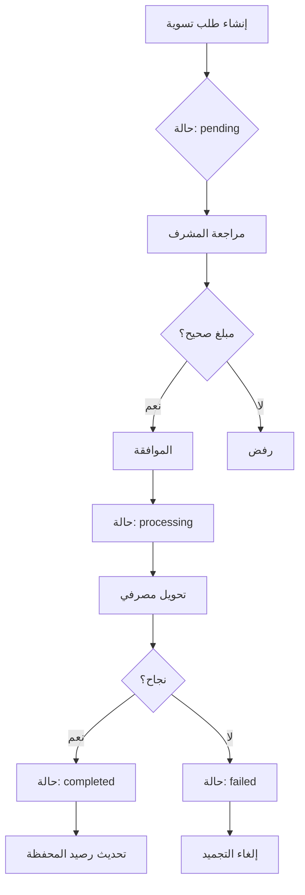

# 02 - البنية المعمارية (Architecture) - تسوية الوكيل (Agent Settlement)

## نظرة عامة على الگarchitecture

معمارية تسوية الوكلاء (Agent Settlement) تتبع نمط **request→Admin review→bank transfer→balance update** ضمن نظام Beza.

```
          +-----------+     +------------+     +-------------+     +-------------+
          |  الوكيل   |     |  المشرف   |     |  النظام    |     |  المحفظة   |
          | (Agent)   |     |  (Admin)  |     |  المصرفي   |     |  (Wallet)  |
          +-----+-----+     +-----+------+     +------+------+     +------+------+
                |                  |                   |                    |
   1.          |                  |                   |                    |
   طلب تسوية  |----------------->|                   |                    |
                |                  |                   |                    |
   2. مراجعة   |                  |                   |                    |
   وموافقة     |<-----------------|                   |                    |
                |                  |                   |                    |
   3. تحويل    |                  |------------------>|                    |
   مصرفي      |                  |                   |                    |
                |                  |                   |                    |
   4. تحديث    |                  |                   |--------------------|
   الرصيد     |                  |                   |                    |
                |                  |                   |                    |
   5. إشعار    |<-----------------|-------------------|--------------------|
   بالوكيل     |                  |                   |                    |
```

## مكدس الطبقات (Layer Stack)

```
Flutter/React SPA --> API Gateway --> Controller --> SettlementService --> Database
                                                |
                                                +--> WalletService
                                                +--> BankTransferService
```

## تدفق الموافقة (Approval Flow)



## الملفات المرتبطة

| الملف | المسار |
|-------|--------|
| Controller | `app/Http/Controllers/Api/AgentSettlementController.php` |
| Service | `app/Services/AgentSettlementService.php` |
| WalletService | `app/Services/WalletService.php` |
| Settlement Model | `app/Models/AgentSettlement.php` |
| Form Request | `app/Http/Requests/AgentSettlementRequest.php` |
| Migration | `database/migrations/xxxx_xx_xx_create_agent_settlements_table.php` |

## مثال على Controller

```php
<?php

namespace App\Http\Controllers\Api;

use App\Http\Controllers\Controller;
use App\Http\Requests\AgentSettlementRequest;
use App\Services\AgentSettlementService;
use Illuminate\Http\JsonResponse;

class AgentSettlementController extends Controller
{
    public function __construct(
        private readonly AgentSettlementService $settlementService
    ) {}

    public function store(AgentSettlementRequest $request): JsonResponse
    {
        $result = $this->settlementService->requestSettlement(
            agent: $request->user(),
            data: $request->validated(),
        );

        return response()->json([
            'success' => true,
            'message' => 'تم إنشاء طلب التسوية بنجاح',
            'data' => $result,
        ], 201);
    }

    public function approve(int $id): JsonResponse
    {
        $result = $this->settlementService->approveSettlement(
            settlementId: $id,
            adminId: auth()->id(),
        );

        return response()->json([
            'success' => true,
            'message' => 'تمت الموافقة على طلب التسوية',
            'data' => $result,
        ]);
    }

    public function reject(int $id, AgentSettlementRequest $request): JsonResponse
    {
        $result = $this->settlementService->rejectSettlement(
            settlementId: $id,
            adminId: auth()->id(),
            reason: $request->input('reason'),
        );

        return response()->json([
            'success' => true,
            'message' => 'تم رفض طلب التسوية',
            'data' => $result,
        ]);
    }
}
```

## مسارات API

```php
// routes/api.php
use App\Http\Controllers\Api\AgentSettlementController;

Route::middleware(['auth:api', 'throttle:30,1'])->group(function () {
    Route::post('/agent/settlement', [AgentSettlementController::class, 'store']);
    Route::get('/agent/settlements', [AgentSettlementController::class, 'index']);
    Route::get('/agent/settlement/{id}', [AgentSettlementController::class, 'show']);

    Route::middleware(['role:admin'])->group(function () {
        Route::post('/agent/settlement/{id}/approve', [AgentSettlementController::class, 'approve']);
        Route::post('/agent/settlement/{id}/reject', [AgentSettlementController::class, 'reject']);
        Route::post('/agent/settlement/{id}/process-bank', [AgentSettlementController::class, 'processBankTransfer']);
    });
});
```

## توقيت الأداء

| الخطوة | الوقت |
|--------|-------|
| إنشاء الطلب | ~50ms |
| مراجعة المشرف | ~100ms (يدوي) |
| تحويل مصرفي | ~2-5s (خارجي) |
| تحديث الرصيد | ~30ms |
| الإجمالي | < 200ms (عدا التحويل) |
